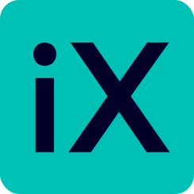

<!--
SPDX-FileCopyrightText: 2023 Siemens AG

SPDX-License-Identifier: MIT
-->



> Siemens Industrial Experience (iX) monorepo


[](./LICENSE.md)

iX is an open-source design system for designers and developers, to consistently create the perfect digital experience for industrial software products.

<h2 align="center">
  <a href="https://ix.siemens.io/docs/installation/">Quickstart</a>
  <span>-</span>
  <a href="https://ix.siemens.io/docs/introduction">
    Documentation
  </a>
  <span>-</span>
  <a href="https://community.siemens.com/c/ix/">Community</a>
</h2>


## Installation

You can find a getting started guide [here](https://ix.siemens.io/docs/installation/)


## Git hooks via husky

Our pipeline lints each commit pushed to remote. To verify that you don't need
to rebase existing commits please install our git hooks.

```sh
# Activate hooks
npx husky install
# or
yarn husky install
```

## 🤝 Contributing

Contributions, issues and feature requests are welcome!

Checkout our [contribution guidelines](/CONTRIBUTING.md)

## 👨‍💻 Maintainers

- Daniel Leroux <daniel.leroux@siemens.com>
- Lukas Maurer <lukas.maurer@siemens.com>

## 📝 License

Copyright © 2022 [Siemens AG](https://www.siemens.com/).

This project is MIT licensed.
