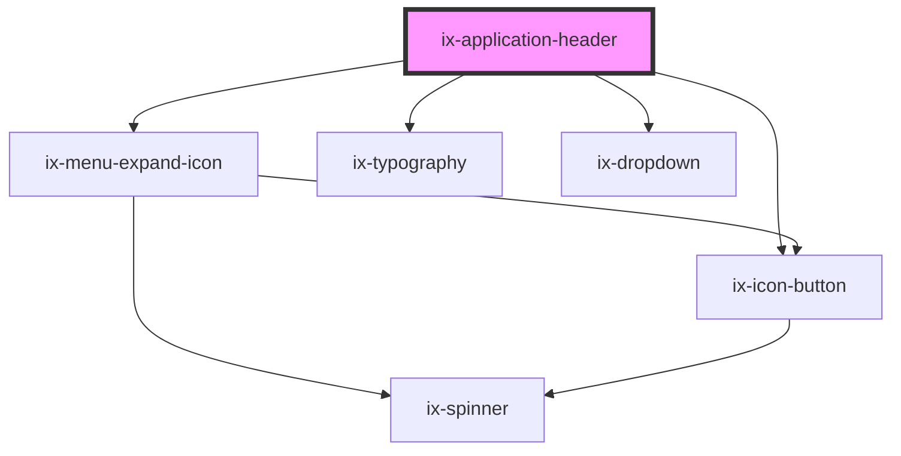

<!-- Auto Generated Below -->

## Properties

| Property                        | Attribute                            | Description                                                                                                                                                                                                                                                                                             | Type                   | Default     |
| ------------------------------- | ------------------------------------ | ------------------------------------------------------------------------------------------------------------------------------------------------------------------------------------------------------------------------------------------------------------------------------------------------------- | ---------------------- | ----------- |
| `appIcon`                       | `app-icon`                           | The app icon will be shown as the first element inside the header. It will be hidden on smaller screens.                                                                                                                                                                                                | `string \| undefined`  | `undefined` |
| `appIconAlt`                    | `app-icon-alt`                       | Alt text for the app icon                                                                                                                                                                                                                                                                               | `string \| undefined`  | `undefined` |
| `appIconOutline`                | `app-icon-outline`                   | Render subtle outline around app icon to ensure proper contrast.                                                                                                                                                                                                                                        | `boolean`              | `false`     |
| `ariaLabelAppSwitchIconButton`  | `aria-label-app-switch-icon-button`  | ARIA label for the app switch icon button                                                                                                                                                                                                                                                               | `string \| undefined`  | `undefined` |
| `ariaLabelMenuExpandIconButton` | `aria-label-menu-expand-icon-button` | ARIA label for the menu expand icon button                                                                                                                                                                                                                                                              | `string \| undefined`  | `undefined` |
| `ariaLabelMoreMenuIconButton`   | `aria-label-more-menu-icon-button`   | ARIA label for the more menu icon button                                                                                                                                                                                                                                                                | `string \| undefined`  | `undefined` |
| `companyLogo`                   | `company-logo`                       | Company logo will be show on the left side of the application name. It will be hidden on smaller screens.                                                                                                                                                                                               | `string \| undefined`  | `undefined` |
| `companyLogoAlt`                | `company-logo-alt`                   | Alt text for the company logo                                                                                                                                                                                                                                                                           | `string \| undefined`  | `undefined` |
| `hideBottomBorder`              | `hide-bottom-border`                 | Hides the bottom border of the header                                                                                                                                                                                                                                                                   | `boolean`              | `false`     |
| `name`                          | `name`                               | Application name                                                                                                                                                                                                                                                                                        | `string \| undefined`  | `undefined` |
| `nameSuffix`                    | `name-suffix`                        | Define a suffix which will be displayed next to the application name                                                                                                                                                                                                                                    | `string \| undefined`  | `undefined` |
| `showMenu`                      | `show-menu`                          | Controls the visibility of the menu toggle button based on the context of the application header.  When the application header is utilized outside the application frame, the menu toggle button is displayed. Conversely, if the header is within the application frame, this property is ineffective. | `boolean \| undefined` | `false`     |

## Events

| Event           | Description                                          | Type                   |
| --------------- | ---------------------------------------------------- | ---------------------- |
| `menuToggle`    | Event emitted when the menu toggle button is clicked | `CustomEvent<boolean>` |
| `openAppSwitch` | Event emitted when the app switch button is clicked  | `CustomEvent<void>`    |

## Slots

| Slot          | Description                                                                                                                                             |
| ------------- | ------------------------------------------------------------------------------------------------------------------------------------------------------- |
| `"default"`   | Place items on the right side of the header. If the screen size is small, the items will be shown inside a dropdown.                                    |
| `"logo"`      | Place a company logo inside the header. Alternatively the companyLogo property can be set.                                                              |
| `"overflow"`  | Use this slot to display additional items that do not fit in the default or secondary slot.                                                             |
| `"secondary"` | Place additional items inside the header. They will appear after logo and name. If the screen size is small, the items will be shown inside a dropdown. |

## Dependencies

### Depends on

- ix-menu-expand-icon
- [ix-icon-button](../icon-button)
- [ix-typography](../typography)
- [ix-dropdown](../dropdown)

### Graph

----------------------------------------------

*Built with [StencilJS](https://stenciljs.com/)*
