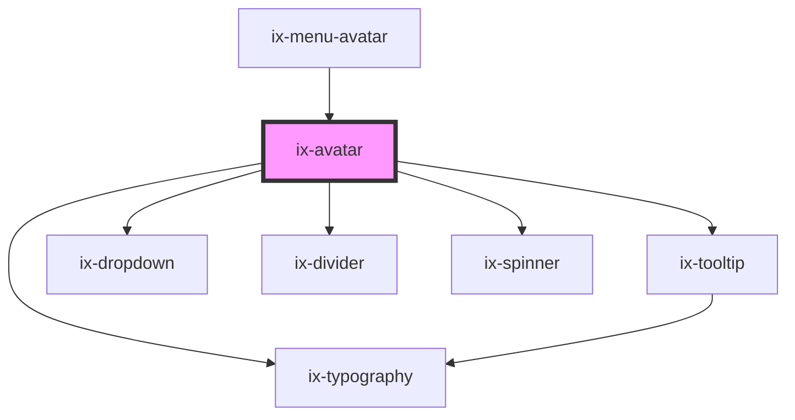

<!-- Auto Generated Below -->

## Properties

| Property           | Attribute            | Description                                                                                                                                                                                                                             | Type                  | Default     |
| ------------------ | -------------------- | --------------------------------------------------------------------------------------------------------------------------------------------------------------------------------------------------------------------------------------- | --------------------- | ----------- |
| `a11yLabel`        | `a11y-label`         | **[DEPRECATED]** Set the native `aria-label` on the ix-avatar host element. Will be removed in 5.0.0  Accessibility label for the image Will be set as aria-label on the nested HTML img element | `string \| undefined` | `undefined` |
| `ariaLabelTooltip` | `aria-label-tooltip` | aria-label for the tooltip                                                                                                                                                                                                              | `string \| undefined` | `undefined` |
| `extra`            | `extra`              | Optional description text that will be displayed underneath the username. Note: Only working if avatar is part of the ix-application-header                                                                                             | `string \| undefined` | `undefined` |
| `image`            | `image`              | Display an avatar image                                                                                                                                                                                                                 | `string \| undefined` | `undefined` |
| `initials`         | `initials`           | Display the initials of the user. Will be overwritten by image                                                                                                                                                                          | `string \| undefined` | `undefined` |
| `tooltipText`      | `tooltip-text`       | Text to display in a tooltip when hovering over the avatar                                                                                                                                                                              | `string \| undefined` | `undefined` |
| `username`         | `username`           | If set an info card displaying the username will be placed inside the dropdown. Note: Only working if avatar is part of the ix-application-header                                                                                       | `string \| undefined` | `undefined` |

## Dependencies

### Used by

 - [ix-menu-avatar](../menu-avatar)

### Depends on

- [ix-tooltip](../tooltip)
- [ix-dropdown](../dropdown)
- [ix-divider](../divider)
- [ix-typography](../typography)
- [ix-spinner](../spinner)

### Graph

----------------------------------------------

*Built with [StencilJS](https://stenciljs.com/)*
