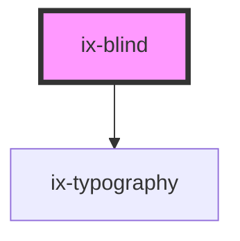

<!-- Auto Generated Below -->

## Properties

| Property    | Attribute   | Description                                            | Type                                                                                                           | Default     |
| ----------- | ----------- | ------------------------------------------------------ | -------------------------------------------------------------------------------------------------------------- | ----------- |
| `collapsed` | `collapsed` | Collapsed state                                        | `boolean`                                                                                                      | `false`     |
| `icon`      | `icon`      | Optional icon to be displayed next to the header label | `string \| undefined`                                                                                          | `undefined` |
| `label`     | `label`     | Label of blind                                         | `string \| undefined`                                                                                          | `undefined` |
| `sublabel`  | `sublabel`  | Secondary label inside blind header                    | `string \| undefined`                                                                                          | `undefined` |
| `variant`   | `variant`   | Blind variant                                          | `"alarm" \| "critical" \| "filled" \| "info" \| "neutral" \| "outline" \| "primary" \| "success" \| "warning"` | `'filled'`  |

## Events

| Event             | Description             | Type                   |
| ----------------- | ----------------------- | ---------------------- |
| `collapsedChange` | Collapsed state changed | `CustomEvent<boolean>` |

## Dependencies

### Depends on

- [ix-typography](../typography)

### Graph

----------------------------------------------

*Built with [StencilJS](https://stenciljs.com/)*
