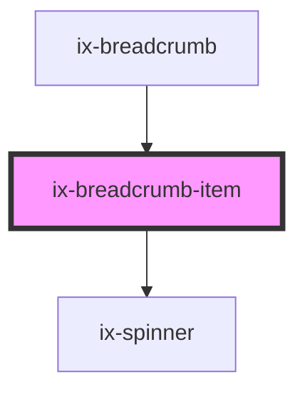

<!-- Auto Generated Below -->

## Properties

| Property          | Attribute           | Description                                                                                            | Type                                                      | Default     |
| ----------------- | ------------------- | ------------------------------------------------------------------------------------------------------ | --------------------------------------------------------- | ----------- |
| `ariaLabelButton` | `aria-label-button` | ARIA label for the button Will be set as aria-label for the nested HTML button element                 | `string \| undefined`                                     | `undefined` |
| `href`            | `href`              | URL for the button link. When provided, the button will render as an anchor tag.                       | `string \| undefined`                                     | `undefined` |
| `icon`            | `icon`              | Icon to be displayed next ot the label                                                                 | `string \| undefined`                                     | `undefined` |
| `label`           | `label`             | Breadcrumb label                                                                                       | `string \| undefined`                                     | `undefined` |
| `rel`             | `rel`               | Specifies the relationship between the current document and the linked document when href is provided. | `string \| undefined`                                     | `undefined` |
| `target`          | `target`            | Specifies where to open the linked document when href is provided.                                     | `"_blank" \| "_parent" \| "_self" \| "_top" \| undefined` | `'_self'`   |

## Dependencies

### Used by

 - [ix-breadcrumb](../breadcrumb)

### Depends on

- [ix-spinner](../spinner)

### Graph

----------------------------------------------

*Built with [StencilJS](https://stenciljs.com/)*
