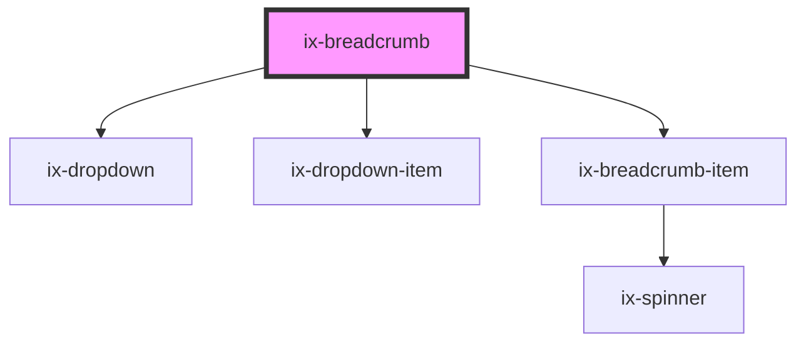

<!-- Auto Generated Below -->

## Properties

| Property                  | Attribute                    | Description                                                                                                                           | Type       | Default      |
| ------------------------- | ---------------------------- | ------------------------------------------------------------------------------------------------------------------------------------- | ---------- | ------------ |
| `ariaLabelPreviousButton` | `aria-label-previous-button` | Accessibility label for the dropdown button (ellipsis icon) used to access the dropdown list with conditionally hidden previous items | `string`   | `'previous'` |
| `nextItems`               | `next-items`                 | Items will be accessible through a dropdown                                                                                           | `string[]` | `[]`         |
| `subtle`                  | `subtle`                     | Ghost breadcrumbs will not show solid backgrounds on individual crumbs unless there is a mouse event (e.g. hover)                     | `boolean`  | `false`      |
| `visibleItemCount`        | `visible-item-count`         | Excess items will get hidden inside of dropdown                                                                                       | `number`   | `9`          |

## Events

| Event       | Description              | Type                                             |
| ----------- | ------------------------ | ------------------------------------------------ |
| `itemClick` | Crumb item clicked event | `CustomEvent<string>`                            |
| `nextClick` | Next item clicked event  | `CustomEvent<{ event: UIEvent; item: string; }>` |

## Dependencies

### Depends on

- [ix-dropdown](../dropdown)
- [ix-dropdown-item](../dropdown-item)
- [ix-breadcrumb-item](../breadcrumb-item)

### Graph

----------------------------------------------

*Built with [StencilJS](https://stenciljs.com/)*
