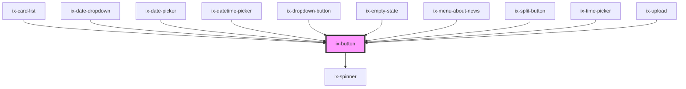

<!-- Auto Generated Below -->

## Properties

| Property          | Attribute           | Description                                                                                                                        | Type                                                                                                                                                                   | Default     |
| ----------------- | ------------------- | ---------------------------------------------------------------------------------------------------------------------------------- | ---------------------------------------------------------------------------------------------------------------------------------------------------------------------- | ----------- |
| `ariaLabelButton` | `aria-label-button` | ARIA label for the button Will be set as aria-label on the nested HTML button element                                              | `string \| undefined`                                                                                                                                                  | `undefined` |
| `disabled`        | `disabled`          | Disable the button                                                                                                                 | `boolean`                                                                                                                                                              | `false`     |
| `form`            | `form`              | Provide a form element ID to automatically submit the from if the button is pressed. Only works in combination with type="submit". | `string \| undefined`                                                                                                                                                  | `undefined` |
| `href`            | `href`              | URL for the button link. When provided, the button will render as an anchor tag.                                                   | `string \| undefined`                                                                                                                                                  | `undefined` |
| `icon`            | `icon`              | Icon name                                                                                                                          | `string \| undefined`                                                                                                                                                  | `undefined` |
| `iconRight`       | `icon-right`        | Icon name for the right side of the button                                                                                         | `string \| undefined`                                                                                                                                                  | `undefined` |
| `loading`         | `loading`           | Loading button                                                                                                                     | `boolean`                                                                                                                                                              | `false`     |
| `rel`             | `rel`               | Specifies the relationship between the current document and the linked document when href is provided.                             | `string \| undefined`                                                                                                                                                  | `undefined` |
| `target`          | `target`            | Specifies where to open the linked document when href is provided.                                                                 | `"_blank" \| "_parent" \| "_self" \| "_top" \| undefined`                                                                                                              | `'_self'`   |
| `type`            | `type`              | Type of the button                                                                                                                 | `"button" \| "submit"`                                                                                                                                                 | `'button'`  |
| `variant`         | `variant`           | Button variant                                                                                                                     | `"danger-primary" \| "danger-secondary" \| "danger-tertiary" \| "primary" \| "secondary" \| "subtle-primary" \| "subtle-secondary" \| "subtle-tertiary" \| "tertiary"` | `'primary'` |

## Dependencies

### Used by

 - [ix-card-list](../card-list)
 - [ix-date-dropdown](../date-dropdown)
 - [ix-date-picker](../date-picker)
 - [ix-datetime-picker](../datetime-picker)
 - [ix-dropdown-button](../dropdown-button)
 - [ix-empty-state](../empty-state)
 - [ix-menu-about-news](../menu-about-news)
 - [ix-split-button](../split-button)
 - [ix-time-picker](../time-picker)
 - [ix-upload](../upload)

### Depends on

- [ix-spinner](../spinner)

### Graph

----------------------------------------------

*Built with [StencilJS](https://stenciljs.com/)*
