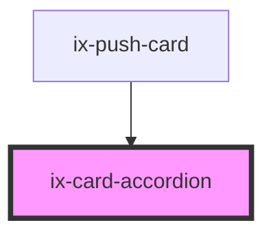

<!-- Auto Generated Below -->

## Properties

| Property                | Attribute                  | Description                                                                                          | Type                                                                                                           | Default     |
| ----------------------- | -------------------------- | ---------------------------------------------------------------------------------------------------- | -------------------------------------------------------------------------------------------------------------- | ----------- |
| `ariaLabelExpandButton` | `aria-label-expand-button` | ARIA label for the card's expand button. Will be set as aria-label on the nested HTML button element | `string \| undefined`                                                                                          | `undefined` |
| `collapse`              | `collapse`                 | Collapse the card                                                                                    | `boolean`                                                                                                      | `false`     |
| `variant`               | `variant`                  | Show accordion with different color variants                                                         | `"alarm" \| "critical" \| "filled" \| "info" \| "neutral" \| "outline" \| "primary" \| "success" \| "warning"` | `'outline'` |

## Dependencies

### Used by

 - [ix-push-card](../push-card)

### Graph

----------------------------------------------

*Built with [StencilJS](https://stenciljs.com/)*
