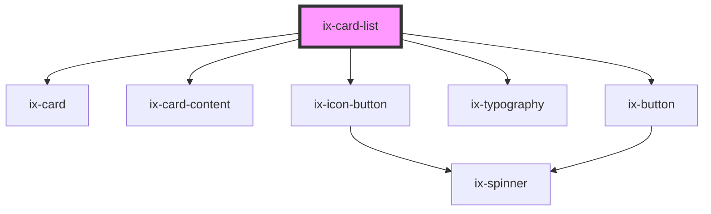

<!-- Auto Generated Below -->

## Properties

| Property                   | Attribute                    | Description                                                                                          | Type                  | Default                            |
| -------------------------- | ---------------------------- | ---------------------------------------------------------------------------------------------------- | --------------------- | ---------------------------------- |
| `ariaLabelExpandButton`    | `aria-label-expand-button`   | ARIA label for the card's expand button. Will be set as aria-label on the nested HTML button element | `string \| undefined` | `undefined`                        |
| `collapse`                 | `collapse`                   | Collapse the list                                                                                    | `boolean`             | `false`                            |
| `hideShowAll`              | `hide-show-all`              | Hide the show all button                                                                             | `boolean`             | `false`                            |
| `i18nMoreCards`            | `i18n-more-cards`            | i18n More cards available                                                                            | `string`              | `'There are more cards available'` |
| `i18nShowAll`              | `i18n-show-all`              | i18n Show all button                                                                                 | `string`              | `'Show all'`                       |
| `label`                    | `label`                      | Name the card list                                                                                   | `string \| undefined` | `undefined`                        |
| `listStyle`                | `list-style`                 | List style                                                                                           | `"scroll" \| "stack"` | `'stack'`                          |
| `showAllCount`             | `show-all-count`             | Overwrite the default show all count.                                                                | `number \| undefined` | `undefined`                        |
| `suppressOverflowHandling` | `suppress-overflow-handling` | Suppress the overflow handling of child elements                                                     | `boolean`             | `false`                            |

## Events

| Event               | Description                                               | Type                                        |
| ------------------- | --------------------------------------------------------- | ------------------------------------------- |
| `collapseChanged`   | Fire event when the collapse state is changed by the user | `CustomEvent<boolean>`                      |
| `showAllClick`      | Fire event when the collapse state is changed by the user | `CustomEvent<{ nativeEvent: MouseEvent; }>` |
| `showMoreCardClick` | Fire event when the show more card is clicked.            | `CustomEvent<{ nativeEvent: MouseEvent; }>` |

## Dependencies

### Depends on

- [ix-card](../card)
- [ix-card-content](../card-content)
- [ix-icon-button](../icon-button)
- [ix-typography](../typography)
- [ix-button](../button)

### Graph

----------------------------------------------

*Built with [StencilJS](https://stenciljs.com/)*
