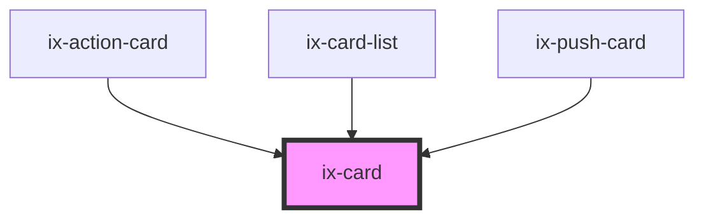

<!-- Auto Generated Below -->

## Properties

| Property   | Attribute  | Description                 | Type                                                                                                           | Default     |
| ---------- | ---------- | --------------------------- | -------------------------------------------------------------------------------------------------------------- | ----------- |
| `selected` | `selected` | Show card in selected state | `boolean`                                                                                                      | `false`     |
| `variant`  | `variant`  | Card variant                | `"alarm" \| "critical" \| "filled" \| "info" \| "neutral" \| "outline" \| "primary" \| "success" \| "warning"` | `'outline'` |

## Dependencies

### Used by

 - [ix-action-card](../action-card)
 - [ix-card-list](../card-list)
 - [ix-push-card](../push-card)

### Graph

----------------------------------------------

*Built with [StencilJS](https://stenciljs.com/)*
