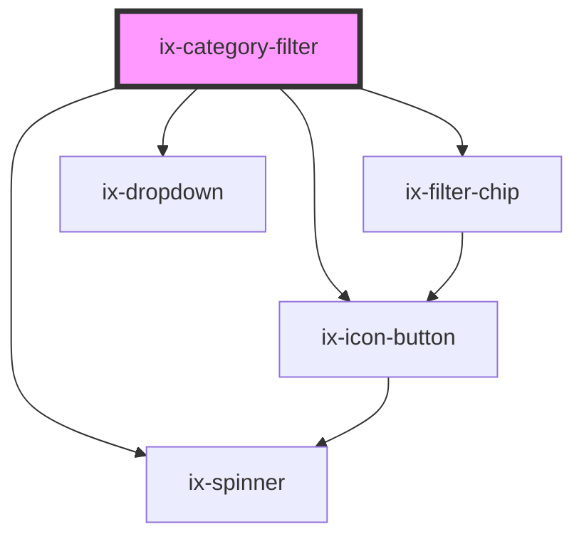

<!-- Auto Generated Below -->

## Properties

| Property                  | Attribute                    | Description                                                                                                                                                                                                                                                                                                                                   | Type                                                                          | Default            |
| ------------------------- | ---------------------------- | --------------------------------------------------------------------------------------------------------------------------------------------------------------------------------------------------------------------------------------------------------------------------------------------------------------------------------------------- | ----------------------------------------------------------------------------- | ------------------ |
| `ariaLabelFilterInput`    | `aria-label-filter-input`    | ARIA label for the filter input Will be set as aria-label on the nested HTML input element                                                                                                                                                                                                                                                    | `string \| undefined`                                                         | `undefined`        |
| `ariaLabelOperatorButton` | `aria-label-operator-button` | ARIA label for the operator button Will be set as aria-label on the nested HTML button element                                                                                                                                                                                                                                                | `string \| undefined`                                                         | `undefined`        |
| `ariaLabelResetButton`    | `aria-label-reset-button`    | ARIA label for the reset button Will be set as aria-label on the nested HTML button element                                                                                                                                                                                                                                                   | `string \| undefined`                                                         | `undefined`        |
| `categories`              | `categories`                 | Configuration object hash used to populate the dropdown menu for type-ahead and quick selection functionality. Each ID maps to an object with a label and an array of options to select from.                                                                                                                                                 | `undefined \| { [id: string]: { label: string; options: string[]; }; }`       | `undefined`        |
| `disabled`                | `disabled`                   | If true the filter will be in disabled state                                                                                                                                                                                                                                                                                                  | `boolean`                                                                     | `false`            |
| `filterState`             | `filter-state`               | A set of search criteria to populate the component with.                                                                                                                                                                                                                                                                                      | `FilterState \| undefined`                                                    | `undefined`        |
| `hideIcon`                | `hide-icon`                  | Allows to hide the icon inside the text input. Defaults to false                                                                                                                                                                                                                                                                              | `boolean`                                                                     | `false`            |
| `i18nPlainText`           | `i18n-plain-text`            | i18n label for 'Filter by text'                                                                                                                                                                                                                                                                                                               | `string`                                                                      | `'Filter by text'` |
| `icon`                    | `icon`                       | The icon next to the actual text input Defaults to 'search'                                                                                                                                                                                                                                                                                   | `string \| undefined`                                                         | `undefined`        |
| `labelCategories`         | `label-categories`           | i18n                                                                                                                                                                                                                                                                                                                                          | `string`                                                                      | `'Categories'`     |
| `nonSelectableCategories` | `non-selectable-categories`  | In certain use cases some categories may not be available for selection anymore. To allow proper display of set filters with these categories this ID to label mapping can be populated.  Configuration object hash used to supply labels to the filter chips in the input field. Each ID maps to a string representing the label to display. | `undefined \| { [id: string]: string; }`                                      | `{}`               |
| `placeholder`             | `placeholder`                | Placeholder text to be displayed in an empty input field.                                                                                                                                                                                                                                                                                     | `string \| undefined`                                                         | `undefined`        |
| `readonly`                | `readonly`                   | If true the filter will be in readonly mode                                                                                                                                                                                                                                                                                                   | `boolean`                                                                     | `false`            |
| `staticOperator`          | `static-operator`            | If set categories will always be filtered via the respective logical operator. Toggling of the operator will not be available to the user.                                                                                                                                                                                                    | `LogicalFilterOperator.EQUAL \| LogicalFilterOperator.NOT_EQUAL \| undefined` | `undefined`        |
| `suggestions`             | `suggestions`                | A list of strings that will be supplied as type-ahead suggestions not tied to any categories.                                                                                                                                                                                                                                                 | `string[] \| undefined`                                                       | `undefined`        |
| `uniqueCategories`        | `unique-categories`          | If set to true, prevents that a single category can be set more than once. An already set category will not appear in the category dropdown if set to true.                                                                                                                                                                                   | `boolean`                                                                     | `false`            |

## Events

| Event             | Description                                                        | Type                       |
| ----------------- | ------------------------------------------------------------------ | -------------------------- |
| `categoryChanged` | Event dispatched whenever a category gets selected in the dropdown | `CustomEvent<string>`      |
| `filterChanged`   | Event dispatched whenever the filter state changes.                | `CustomEvent<FilterState>` |
| `filterCleared`   | Event dispatched whenever the filter gets cleared.                 | `CustomEvent<void>`        |
| `inputChanged`    | Event dispatched whenever the text input changes.                  | `CustomEvent<InputState>`  |

## Dependencies

### Depends on

- [ix-icon-button](../icon-button)
- [ix-filter-chip](../filter-chip)
- [ix-dropdown](../dropdown)
- [ix-spinner](../spinner)

### Graph

----------------------------------------------

*Built with [StencilJS](https://stenciljs.com/)*
