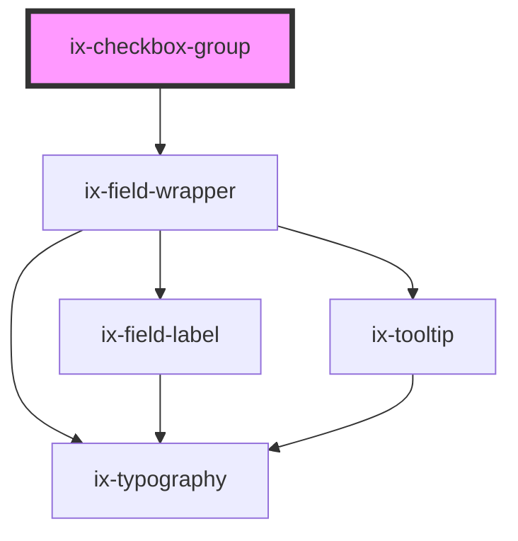

<!-- Auto Generated Below -->

## Properties

| Property            | Attribute              | Description                                                 | Type                  | Default     |
| ------------------- | ---------------------- | ----------------------------------------------------------- | --------------------- | ----------- |
| `direction`         | `direction`            | Alignment of the checkboxes in the group                    | `"column" \| "row"`   | `'column'`  |
| `helperText`        | `helper-text`          | Optional helper text displayed below the checkbox group     | `string \| undefined` | `undefined` |
| `infoText`          | `info-text`            | Info text for the checkbox group                            | `string \| undefined` | `undefined` |
| `invalidText`       | `invalid-text`         | Error text for the checkbox group                           | `string \| undefined` | `undefined` |
| `label`             | `label`                | Label for the checkbox group                                | `string \| undefined` | `undefined` |
| `showTextAsTooltip` | `show-text-as-tooltip` | Show helper, info, warning, error and valid text as tooltip | `boolean`             | `false`     |
| `validText`         | `valid-text`           | Valid text for the checkbox group                           | `string \| undefined` | `undefined` |
| `warningText`       | `warning-text`         | Warning text for the checkbox group                         | `string \| undefined` | `undefined` |

## Dependencies

### Depends on

- ix-field-wrapper

### Graph

----------------------------------------------

*Built with [StencilJS](https://stenciljs.com/)*
