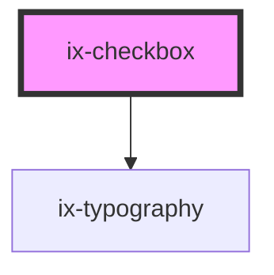

<!-- Auto Generated Below -->

## Properties

| Property        | Attribute       | Description                                                                                  | Type                  | Default     |
| --------------- | --------------- | -------------------------------------------------------------------------------------------- | --------------------- | ----------- |
| `checked`       | `checked`       | Checked state of the checkbox component                                                      | `boolean`             | `false`     |
| `disabled`      | `disabled`      | Disabled state of the checkbox component                                                     | `boolean`             | `false`     |
| `indeterminate` | `indeterminate` | Indeterminate state of the checkbox component                                                | `boolean`             | `false`     |
| `label`         | `label`         | Label for the checkbox component                                                             | `string \| undefined` | `undefined` |
| `name`          | `name`          | Name of the checkbox component                                                               | `string \| undefined` | `undefined` |
| `required`      | `required`      | Required state of the checkbox component.  If true, checkbox needs to be checked to be valid | `boolean`             | `false`     |
| `value`         | `value`         | Value of the checkbox component                                                              | `string`              | `'on'`      |

## Events

| Event           | Description                                                  | Type                   |
| --------------- | ------------------------------------------------------------ | ---------------------- |
| `checkedChange` | Event emitted when the checked state of the checkbox changes | `CustomEvent<boolean>` |
| `ixBlur`        | Event emitted when the checkbox is blurred                   | `CustomEvent<void>`    |
| `valueChange`   | Event emitted when the value of the checkbox changes         | `CustomEvent<string>`  |

## Dependencies

### Depends on

- [ix-typography](../typography)

### Graph

----------------------------------------------

*Built with [StencilJS](https://stenciljs.com/)*
