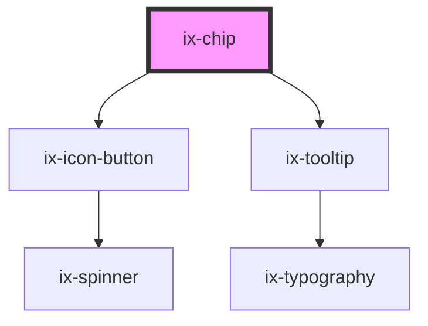

<!-- Auto Generated Below -->

## Properties

| Property               | Attribute                 | Description                                                                                                                                                                        | Type                                                                                              | Default     |
| ---------------------- | ------------------------- | ---------------------------------------------------------------------------------------------------------------------------------------------------------------------------------- | ------------------------------------------------------------------------------------------------- | ----------- |
| `ariaLabelCloseButton` | `aria-label-close-button` | ARIA label for the close button Will be set as aria-label on the nested HTML button element                                                                                        | `string \| undefined`                                                                             | `undefined` |
| `background`           | `background`              | Custom background color. Only has an effect on chips with `variant='custom'`                                                                                                       | `string \| undefined`                                                                             | `undefined` |
| `centerContent`        | `center-content`          | Center the content of the chip. Set to false to disable centering.                                                                                                                 | `boolean`                                                                                         | `false`     |
| `chipColor`            | `chip-color`              | Custom font and icon color. Only has an effect on chips with `variant='custom'`                                                                                                    | `string \| undefined`                                                                             | `undefined` |
| `closable`             | `closable`                | Show close icon                                                                                                                                                                    | `boolean`                                                                                         | `false`     |
| `icon`                 | `icon`                    | Show icon                                                                                                                                                                          | `string \| undefined`                                                                             | `undefined` |
| `inactive`             | `inactive`                | Determines if the chip is interactive. If true no user input (e.g. mouse states, keyboard navigation) will be possible and also the close button will not be present.              | `boolean`                                                                                         | `false`     |
| `outline`              | `outline`                 | Show chip with outline style                                                                                                                                                       | `boolean`                                                                                         | `false`     |
| `tooltipText`          | `tooltip-text`            | Display a tooltip. By default, no tooltip will be displayed. Add the attribute to display the text content of the component as a tooltip or use a string to display a custom text. | `boolean \| string`                                                                               | `false`     |
| `variant`              | `variant`                 | Chip variant                                                                                                                                                                       | `"alarm" \| "critical" \| "custom" \| "info" \| "neutral" \| "primary" \| "success" \| "warning"` | `'primary'` |

## Events

| Event       | Description                           | Type               |
| ----------- | ------------------------------------- | ------------------ |
| `closeChip` | Fire event if close button is clicked | `CustomEvent<any>` |

## Dependencies

### Depends on

- [ix-icon-button](../icon-button)
- [ix-tooltip](../tooltip)

### Graph

----------------------------------------------

*Built with [StencilJS](https://stenciljs.com/)*
