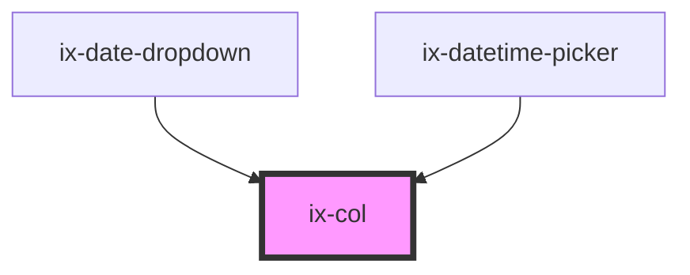

<!-- Auto Generated Below -->

## Properties

| Property | Attribute | Description                       | Type                                                                                                         | Default     |
| -------- | --------- | --------------------------------- | ------------------------------------------------------------------------------------------------------------ | ----------- |
| `size`   | `size`    | Size of the column                | `"1" \| "10" \| "11" \| "12" \| "2" \| "3" \| "4" \| "5" \| "6" \| "7" \| "8" \| "9" \| "auto" \| undefined` | `undefined` |
| `sizeLg` | `size-lg` | Size of the column for lg screens | `"1" \| "10" \| "11" \| "12" \| "2" \| "3" \| "4" \| "5" \| "6" \| "7" \| "8" \| "9" \| "auto" \| undefined` | `undefined` |
| `sizeMd` | `size-md` | Size of the column for md screens | `"1" \| "10" \| "11" \| "12" \| "2" \| "3" \| "4" \| "5" \| "6" \| "7" \| "8" \| "9" \| "auto" \| undefined` | `undefined` |
| `sizeSm` | `size-sm` | Size of the column for sm screens | `"1" \| "10" \| "11" \| "12" \| "2" \| "3" \| "4" \| "5" \| "6" \| "7" \| "8" \| "9" \| "auto" \| undefined` | `undefined` |

## Dependencies

### Used by

 - [ix-date-dropdown](../date-dropdown)
 - [ix-datetime-picker](../datetime-picker)

### Graph

----------------------------------------------

*Built with [StencilJS](https://stenciljs.com/)*
