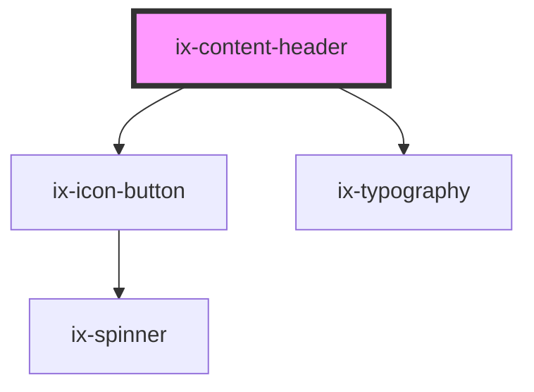

<!-- Auto Generated Below -->

## Properties

| Property         | Attribute         | Description               | Type                       | Default     |
| ---------------- | ----------------- | ------------------------- | -------------------------- | ----------- |
| `hasBackButton`  | `has-back-button` | Display a back button     | `boolean`                  | `false`     |
| `headerSubtitle` | `header-subtitle` | Subtitle of Header        | `string \| undefined`      | `undefined` |
| `headerTitle`    | `header-title`    | Title of Header           | `string \| undefined`      | `undefined` |
| `variant`        | `variant`         | Variant of content header | `"primary" \| "secondary"` | `'primary'` |

## Events

| Event             | Description                           | Type                |
| ----------------- | ------------------------------------- | ------------------- |
| `backButtonClick` | Triggered when back button is clicked | `CustomEvent<void>` |

## Slots

| Slot       | Description                                               |
| ---------- | --------------------------------------------------------- |
|            | Default slot for action buttons or other content          |
| `"header"` | Content to be placed in the header area next to the title |

## Dependencies

### Depends on

- [ix-icon-button](../icon-button)
- [ix-typography](../typography)

### Graph

----------------------------------------------

*Built with [StencilJS](https://stenciljs.com/)*
