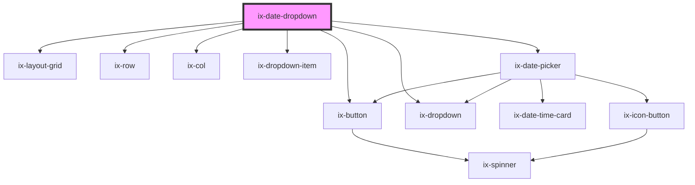

<!-- Auto Generated Below -->

## Properties

| Property                  | Attribute                    | Description                                                                                                                                                                                                                                                                                                                                                                                        | Type                                                                                                                                                                   | Default          |
| ------------------------- | ---------------------------- | -------------------------------------------------------------------------------------------------------------------------------------------------------------------------------------------------------------------------------------------------------------------------------------------------------------------------------------------------------------------------------------------------- | ---------------------------------------------------------------------------------------------------------------------------------------------------------------------- | ---------------- |
| `ariaLabelDropdownButton` | `aria-label-dropdown-button` | ARIA label for the dropdown Will be set as aria-label on the nested HTML button element that will trigger the dropdown                                                                                                                                                                                                                                                                             | `string \| undefined`                                                                                                                                                  | `undefined`      |
| `customRangeDisabled`     | `custom-range-disabled`      | Controls whether custom date range selection is disabled in the component. When set to 'false', the user can select a custom date range using the date picker. When set to 'true', only predefined time date ranges are available for selection.                                                                                                                                                   | `boolean`                                                                                                                                                              | `false`          |
| `dateRangeId`             | `date-range-id`              | Used to set the initial select date range as well as the button name, if not set or no according date range label is found, nothing will be selected                                                                                                                                                                                                                                               | `string`                                                                                                                                                               | `'custom'`       |
| `dateRangeOptions`        | `date-range-options`         | An array of predefined date range options for the date picker. Each option is an object with a label describing the range and a function that returns the start and end dates of the range as a DateRangeOption object.  Example format:   {     id: 'some unique id',     label: 'Name of the range',     from: undefined, to: '2023/03/29'   },   // ... other predefined date range options ... | `DateDropdownOption[]`                                                                                                                                                 | `[]`             |
| `disabled`                | `disabled`                   | Disable the button that opens the dropdown containing the date picker.                                                                                                                                                                                                                                                                                                                             | `boolean`                                                                                                                                                              | `false`          |
| `format`                  | `format`                     | Date format string. See {@link https://moment.github.io/luxon/#/formatting?id=table-of-tokens} for all available tokens.                                                                                                                                                                                                                                                                           | `string`                                                                                                                                                               | `'yyyy/LL/dd'`   |
| `from`                    | `from`                       | Picker date. If the picker is in range mode this property is the start date. If set to `null` no default start date will be pre-selected.  Format is based on `format`                                                                                                                                                                                                                             | `string`                                                                                                                                                               | `''`             |
| `i18nCustomItem`          | `i18n-custom-item`           | Text for custom dropdown item. Will be used for translation.                                                                                                                                                                                                                                                                                                                                       | `string`                                                                                                                                                               | `'Custom...'`    |
| `i18nDone`                | `i18n-done`                  | Text for the done button. Will be used for translation.                                                                                                                                                                                                                                                                                                                                            | `string`                                                                                                                                                               | `'Done'`         |
| `i18nNoRange`             | `i18n-no-range`              | Text for the done button. Will be used for translation.                                                                                                                                                                                                                                                                                                                                            | `string`                                                                                                                                                               | `'No range set'` |
| `loading`                 | `loading`                    | Loading button                                                                                                                                                                                                                                                                                                                                                                                     | `boolean`                                                                                                                                                              | `false`          |
| `locale`                  | `locale`                     | Locale identifier (e.g. 'en' or 'de').                                                                                                                                                                                                                                                                                                                                                             | `string \| undefined`                                                                                                                                                  | `undefined`      |
| `maxDate`                 | `max-date`                   | The latest date that can be selected by the date picker. If not set there will be no restriction.                                                                                                                                                                                                                                                                                                  | `string`                                                                                                                                                               | `''`             |
| `minDate`                 | `min-date`                   | The earliest date that can be selected by the date picker. If not set there will be no restriction.                                                                                                                                                                                                                                                                                                | `string`                                                                                                                                                               | `''`             |
| `showWeekNumbers`         | `show-week-numbers`          | Shows week numbers displayed on the left side of the date picker                                                                                                                                                                                                                                                                                                                                   | `boolean`                                                                                                                                                              | `false`          |
| `singleSelection`         | `single-selection`           | If true disables date range selection (from/to).                                                                                                                                                                                                                                                                                                                                                   | `boolean`                                                                                                                                                              | `false`          |
| `to`                      | `to`                         | Picker date. If the picker is in range mode this property is the end date. If the picker is not in range mode leave this value `null`  Format is based on `format`                                                                                                                                                                                                                                 | `string`                                                                                                                                                               | `''`             |
| `variant`                 | `variant`                    | Button variant                                                                                                                                                                                                                                                                                                                                                                                     | `"danger-primary" \| "danger-secondary" \| "danger-tertiary" \| "primary" \| "secondary" \| "subtle-primary" \| "subtle-secondary" \| "subtle-tertiary" \| "tertiary"` | `'primary'`      |
| `weekStartIndex`          | `week-start-index`           | The index of which day to start the week on, based on the Locale#weekdays array. E.g. if the locale is en-us, weekStartIndex = 1 results in starting the week on monday.                                                                                                                                                                                                                           | `number`                                                                                                                                                               | `0`              |

## Events

| Event             | Description                                                                                                                                                                               | Type                                                                                 |
| ----------------- | ----------------------------------------------------------------------------------------------------------------------------------------------------------------------------------------- | ------------------------------------------------------------------------------------ |
| `dateRangeChange` | EventEmitter for date range change events.  This event is emitted when the date range changes within the component. The event payload contains information about the selected date range. | `CustomEvent<{ id: string; from?: string \| undefined; to?: string \| undefined; }>` |

## Methods

### `getDateRange() => Promise<DateRangeChangeEvent>`

Retrieves the currently selected date range from the component.
This method returns the selected date range as a `DateChangeEvent` object.

#### Returns

Type: `Promise<DateRangeChangeEvent>`

## Dependencies

### Depends on

- [ix-button](../button)
- [ix-dropdown](../dropdown)
- [ix-layout-grid](../layout-grid)
- [ix-row](../row)
- [ix-col](../col)
- [ix-dropdown-item](../dropdown-item)
- [ix-date-picker](../date-picker)

### Graph

----------------------------------------------

*Built with [StencilJS](https://stenciljs.com/)*
