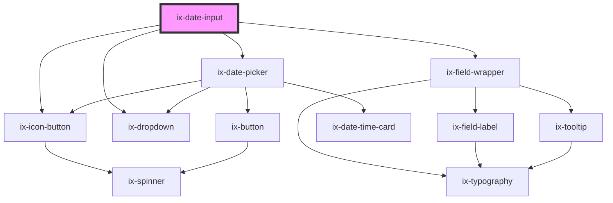

<!-- Auto Generated Below -->

## Properties

| Property                       | Attribute                          | Description                                                                                                                                                                                                                                                                                                                                             | Type                   | Default               |
| ------------------------------ | ---------------------------------- | ------------------------------------------------------------------------------------------------------------------------------------------------------------------------------------------------------------------------------------------------------------------------------------------------------------------------------------------------------- | ---------------------- | --------------------- |
| `ariaLabelCalendarButton`      | `aria-label-calendar-button`       | ARIA label for the calendar icon button Will be set as aria-label on the nested HTML button element                                                                                                                                                                                                                                                     | `string \| undefined`  | `undefined`           |
| `ariaLabelNextMonthButton`     | `aria-label-next-month-button`     | ARIA label for the next month icon button Will be set as aria-label on the nested HTML button element                                                                                                                                                                                                                                                   | `string \| undefined`  | `undefined`           |
| `ariaLabelPreviousMonthButton` | `aria-label-previous-month-button` | ARIA label for the previous month icon button Will be set as aria-label on the nested HTML button element                                                                                                                                                                                                                                               | `string \| undefined`  | `undefined`           |
| `disabled`                     | `disabled`                         | Disabled attribute                                                                                                                                                                                                                                                                                                                                      | `boolean`              | `false`               |
| `format`                       | `format`                           | Date format string. See {@link https://moment.github.io/luxon/#/formatting?id=table-of-tokens} for all available tokens.                                                                                                                                                                                                                                | `string`               | `'yyyy/LL/dd'`        |
| `helperText`                   | `helper-text`                      | Helper text below the input field                                                                                                                                                                                                                                                                                                                       | `string \| undefined`  | `undefined`           |
| `i18nErrorDateUnparsable`      | `i18n-error-date-unparsable`       | I18n string for the error message when the date is not parsable                                                                                                                                                                                                                                                                                         | `string`               | `'Date is not valid'` |
| `infoText`                     | `info-text`                        | Info text below the input field                                                                                                                                                                                                                                                                                                                         | `string \| undefined`  | `undefined`           |
| `invalidText`                  | `invalid-text`                     | Error text below the input field                                                                                                                                                                                                                                                                                                                        | `string \| undefined`  | `undefined`           |
| `label`                        | `label`                            | Label of the input field                                                                                                                                                                                                                                                                                                                                | `string \| undefined`  | `undefined`           |
| `locale`                       | `locale`                           | Locale identifier (e.g. 'en' or 'de'). The locale is used to translate the labels for weekdays and months. It also determines the default order of weekdays based on the locale's conventions. When the locale changes, the weekday labels are rotated according to the `weekStartIndex`. It does not affect the values returned by methods and events. | `string \| undefined`  | `undefined`           |
| `maxDate`                      | `max-date`                         | The latest date that can be selected by the date input/picker. If not set there will be no restriction.                                                                                                                                                                                                                                                 | `string`               | `''`                  |
| `minDate`                      | `min-date`                         | The earliest date that can be selected by the date input/picker. If not set there will be no restriction.                                                                                                                                                                                                                                               | `string`               | `''`                  |
| `name`                         | `name`                             | Name of the input element                                                                                                                                                                                                                                                                                                                               | `string \| undefined`  | `undefined`           |
| `placeholder`                  | `placeholder`                      | Placeholder of the input element                                                                                                                                                                                                                                                                                                                        | `string \| undefined`  | `undefined`           |
| `readonly`                     | `readonly`                         | Readonly attribute                                                                                                                                                                                                                                                                                                                                      | `boolean`              | `false`               |
| `required`                     | `required`                         | Required attribute                                                                                                                                                                                                                                                                                                                                      | `boolean \| undefined` | `undefined`           |
| `showTextAsTooltip`            | `show-text-as-tooltip`             | Show text as tooltip                                                                                                                                                                                                                                                                                                                                    | `boolean \| undefined` | `undefined`           |
| `showWeekNumbers`              | `show-week-numbers`                | Shows week numbers displayed on the left side of the date picker                                                                                                                                                                                                                                                                                        | `boolean`              | `false`               |
| `validText`                    | `valid-text`                       | Valid text below the input field                                                                                                                                                                                                                                                                                                                        | `string \| undefined`  | `undefined`           |
| `value`                        | `value`                            | Value of the input element                                                                                                                                                                                                                                                                                                                              | `string \| undefined`  | `''`                  |
| `warningText`                  | `warning-text`                     | Warning text below the input field                                                                                                                                                                                                                                                                                                                      | `string \| undefined`  | `undefined`           |
| `weekStartIndex`               | `week-start-index`                 | The index of which day to start the week on, based on the Locale#weekdays array. E.g. if the locale is en-us, weekStartIndex = 1 results in starting the week on monday.                                                                                                                                                                                | `number`               | `0`                   |

## Events

| Event                 | Description                    | Type                                                                              |
| --------------------- | ------------------------------ | --------------------------------------------------------------------------------- |
| `validityStateChange` | Validation state change event. | `CustomEvent<{ patternMismatch: boolean; invalidReason?: string \| undefined; }>` |
| `valueChange`         | Input change event.            | `CustomEvent<string \| undefined>`                                                |

## Methods

### `focusInput() => Promise<void>`

Focuses the input field

#### Returns

Type: `Promise<void>`

### `getNativeInputElement() => Promise<HTMLInputElement>`

Get the native input element

#### Returns

Type: `Promise<HTMLInputElement>`

## Slots

| Slot      | Description                                         |
| --------- | --------------------------------------------------- |
| `"end"`   | Element will be displayed at the end of the input   |
| `"start"` | Element will be displayed at the start of the input |

## Dependencies

### Depends on

- [ix-icon-button](../icon-button)
- ix-field-wrapper
- [ix-dropdown](../dropdown)
- [ix-date-picker](../date-picker)

### Graph

----------------------------------------------

*Built with [StencilJS](https://stenciljs.com/)*
