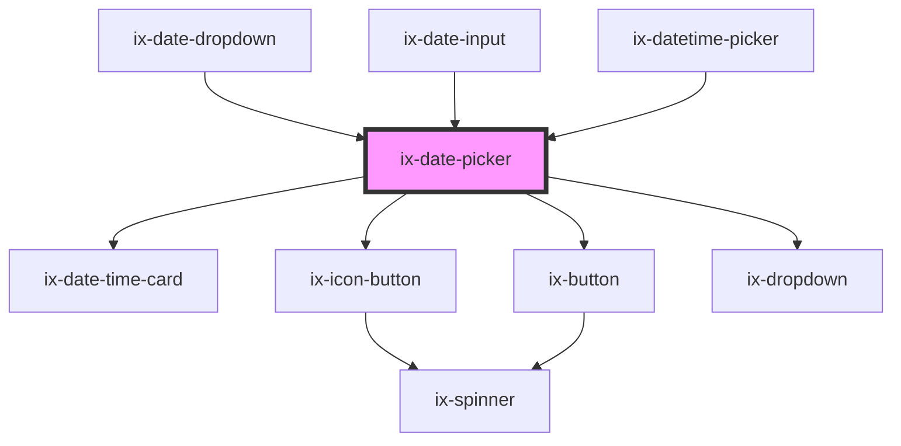

<!-- Auto Generated Below -->

## Properties

| Property                       | Attribute                          | Description                                                                                                                                                                                                                                                                                                                                             | Type                                           | Default        |
| ------------------------------ | ---------------------------------- | ------------------------------------------------------------------------------------------------------------------------------------------------------------------------------------------------------------------------------------------------------------------------------------------------------------------------------------------------------- | ---------------------------------------------- | -------------- |
| `ariaLabelNextMonthButton`     | `aria-label-next-month-button`     | ARIA label for the next month icon button Will be set as aria-label on the nested HTML button element                                                                                                                                                                                                                                                   | `string \| undefined`                          | `undefined`    |
| `ariaLabelPreviousMonthButton` | `aria-label-previous-month-button` | ARIA label for the previous month icon button Will be set as aria-label on the nested HTML button element                                                                                                                                                                                                                                               | `string \| undefined`                          | `undefined`    |
| `corners`                      | `corners`                          | Corner style                                                                                                                                                                                                                                                                                                                                            | `"left" \| "right" \| "rounded" \| "straight"` | `'rounded'`    |
| `format`                       | `format`                           | Date format string. See {@link https://moment.github.io/luxon/#/formatting?id=table-of-tokens} for all available tokens.                                                                                                                                                                                                                                | `string`                                       | `'yyyy/LL/dd'` |
| `from`                         | `from`                             | The selected starting date. If the date-picker-rework is not in range mode this is the selected date. Format has to match the `format` property.                                                                                                                                                                                                        | `string \| undefined`                          | `undefined`    |
| `i18nDone`                     | `i18n-done`                        | Text of date select button                                                                                                                                                                                                                                                                                                                              | `string`                                       | `'Done'`       |
| `locale`                       | `locale`                           | Locale identifier (e.g. 'en' or 'de'). The locale is used to translate the labels for weekdays and months. It also determines the default order of weekdays based on the locale's conventions. When the locale changes, the weekday labels are rotated according to the `weekStartIndex`. It does not affect the values returned by methods and events. | `string \| undefined`                          | `undefined`    |
| `maxDate`                      | `max-date`                         | The latest date that can be selected by the date picker. If not set there will be no restriction.                                                                                                                                                                                                                                                       | `string`                                       | `''`           |
| `minDate`                      | `min-date`                         | The earliest date that can be selected by the date picker. If not set there will be no restriction.                                                                                                                                                                                                                                                     | `string`                                       | `''`           |
| `showWeekNumbers`              | `show-week-numbers`                | Shows week numbers displayed on the left side of the date picker                                                                                                                                                                                                                                                                                        | `boolean`                                      | `false`        |
| `singleSelection`              | `single-selection`                 | If true disables date range selection (from/to).                                                                                                                                                                                                                                                                                                        | `boolean`                                      | `false`        |
| `to`                           | `to`                               | The selected end date. If the the date-picker-rework is not in range mode this property has no impact. Format has to match the `format` property.                                                                                                                                                                                                       | `string \| undefined`                          | `undefined`    |
| `weekStartIndex`               | `week-start-index`                 | The index of which day to start the week on, based on the Locale#weekdays array. E.g. if the locale is en-us, weekStartIndex = 1 results in starting the week on monday.                                                                                                                                                                                | `number`                                       | `0`            |

## Events

| Event             | Description                                                                                                                                                                                                                                                                                                                             | Type                                                                     |
| ----------------- | --------------------------------------------------------------------------------------------------------------------------------------------------------------------------------------------------------------------------------------------------------------------------------------------------------------------------------------- | ------------------------------------------------------------------------ |
| `dateChange`      | Emitted when the date selection changes. The `DateChangeEvent` contains `from` and `to` properties. The property strings are formatted according to the `format` property and not affected by the `locale` property. The locale applied is always `en-US`. Note: Since 2.0.0 `dateChange` does not dispatch detail property as `string` | `CustomEvent<{ from?: string \| undefined; to?: string \| undefined; }>` |
| `dateRangeChange` | Emitted when the date range selection changes and the component is in range mode. The `DateChangeEvent` contains `from` and `to` properties. The property strings are formatted according to the `format` property and not affected by the `locale` property. The locale applied is always `en-US`.                                     | `CustomEvent<{ from?: string \| undefined; to?: string \| undefined; }>` |
| `dateSelect`      | Emitted when the selection is confirmed via the date select button. The `DateChangeEvent` contains `from` and `to` properties. The property strings are formatted according to the `format` property and not affected by the `locale` property. The locale applied is always `en-US`.                                                   | `CustomEvent<{ from?: string \| undefined; to?: string \| undefined; }>` |

## Methods

### `getCurrentDate() => Promise<DateChangeEvent>`

Get the currently selected date or range. The object returned contains `from` and `to` properties.
The property strings are formatted according to the `format` property and not affected by the `locale` property.
The locale applied is always `en-US`.

#### Returns

Type: `Promise<DateChangeEvent>`

## Dependencies

### Used by

 - [ix-date-dropdown](../date-dropdown)
 - [ix-date-input](../date-input)
 - [ix-datetime-picker](../datetime-picker)

### Depends on

- ix-date-time-card
- [ix-icon-button](../icon-button)
- [ix-button](../button)
- [ix-dropdown](../dropdown)

### Graph

----------------------------------------------

*Built with [StencilJS](https://stenciljs.com/)*
