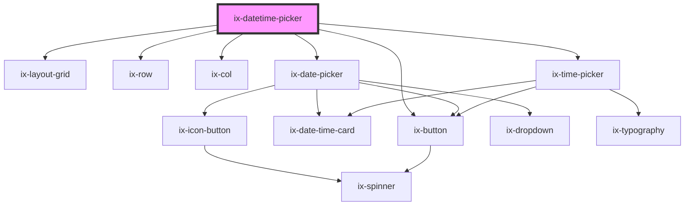

<!-- Auto Generated Below -->

## Properties

| Property                       | Attribute                          | Description                                                                                                                                                              | Type                        | Default        |
| ------------------------------ | ---------------------------------- | ------------------------------------------------------------------------------------------------------------------------------------------------------------------------ | --------------------------- | -------------- |
| `ariaLabelNextMonthButton`     | `aria-label-next-month-button`     | ARIA label for the next month icon button Will be set as aria-label on the nested HTML button element                                                                    | `string \| undefined`       | `undefined`    |
| `ariaLabelPreviousMonthButton` | `aria-label-previous-month-button` | ARIA label for the previous month icon button Will be set as aria-label on the nested HTML button element                                                                | `string \| undefined`       | `undefined`    |
| `dateFormat`                   | `date-format`                      | Date format string. See {@link https://moment.github.io/luxon/#/formatting?id=table-of-tokens} for all available tokens.                                                 | `string`                    | `'yyyy/LL/dd'` |
| `from`                         | `from`                             | The selected starting date. If the picker is not in range mode this is the selected date. Format has to match the `format` property.                                     | `string \| undefined`       | `undefined`    |
| `i18nDone`                     | `i18n-done`                        | Text of date select button                                                                                                                                               | `string`                    | `'Done'`       |
| `i18nTime`                     | `i18n-time`                        | Top label of time picker                                                                                                                                                 | `string`                    | `'Time'`       |
| `locale`                       | `locale`                           | Format of time string See {@link https://moment.github.io/luxon/#/formatting?id=table-of-tokens} for all available tokens.                                               | `string \| undefined`       | `undefined`    |
| `maxDate`                      | `max-date`                         | The latest date that can be selected by the date picker. If not set there will be no restriction.                                                                        | `string \| undefined`       | `undefined`    |
| `minDate`                      | `min-date`                         | The earliest date that can be selected by the date picker. If not set there will be no restriction.                                                                      | `string \| undefined`       | `undefined`    |
| `showTimeReference`            | `show-time-reference`              | Show time reference input Time reference is default aligned with                                                                                                         | `boolean`                   | `false`        |
| `showWeekNumbers`              | `show-week-numbers`                | Shows week numbers displayed on the left side of the date picker                                                                                                         | `boolean`                   | `false`        |
| `singleSelection`              | `single-selection`                 | If true disables date range selection (from/to).                                                                                                                         | `boolean`                   | `false`        |
| `time`                         | `time`                             | Select time with format string                                                                                                                                           | `string \| undefined`       | `undefined`    |
| `timeFormat`                   | `time-format`                      | Time format string. See {@link https://moment.github.io/luxon/#/formatting?id=table-of-tokens} for all available tokens.                                                 | `string`                    | `'HH:mm:ss'`   |
| `timeReference`                | `time-reference`                   | Set time reference                                                                                                                                                       | `"AM" \| "PM" \| undefined` | `undefined`    |
| `to`                           | `to`                               | The selected end date. If the the picker is not in range mode this property has no impact. Format has to match the `format` property.                                    | `string \| undefined`       | `undefined`    |
| `weekStartIndex`               | `week-start-index`                 | The index of which day to start the week on, based on the Locale#weekdays array. E.g. if the locale is en-us, weekStartIndex = 1 results in starting the week on monday. | `number`                    | `0`            |

## Events

| Event        | Description                                                       | Type                                                                                   |
| ------------ | ----------------------------------------------------------------- | -------------------------------------------------------------------------------------- |
| `dateChange` | Date change                                                       | `CustomEvent<string \| { from?: string \| undefined; to?: string \| undefined; }>`     |
| `dateSelect` | Datetime selection event is fired after confirm button is pressed | `CustomEvent<{ from?: string \| undefined; to?: string \| undefined; time: string; }>` |
| `timeChange` | Time change                                                       | `CustomEvent<string>`                                                                  |

## Dependencies

### Depends on

- [ix-layout-grid](../layout-grid)
- [ix-row](../row)
- [ix-col](../col)
- [ix-date-picker](../date-picker)
- [ix-time-picker](../time-picker)
- [ix-button](../button)

### Graph

----------------------------------------------

*Built with [StencilJS](https://stenciljs.com/)*
