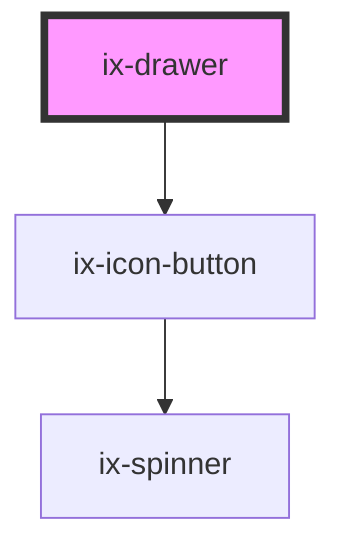

<!-- Auto Generated Below -->

> **[DEPRECATED]** Will be removed with 5.0.0, use ix-pane as successor

## Properties

| Property               | Attribute                 | Description                                                                                      | Type                  | Default         |
| ---------------------- | ------------------------- | ------------------------------------------------------------------------------------------------ | --------------------- | --------------- |
| `ariaLabelCloseButton` | `aria-label-close-button` | ARIA label for the close icon button Will be set as aria-label on the nested HTML button element | `string \| undefined` | `undefined`     |
| `closeOnClickOutside`  | `close-on-click-outside`  | Fired in case of an outside click during drawer showed state                                     | `boolean`             | `true`          |
| `fullHeight`           | `full-height`             | Render the drawer with maximum height                                                            | `boolean`             | `false`         |
| `maxWidth`             | `max-width`               | Max width interpreted as REM                                                                     | `number`              | `28`            |
| `minWidth`             | `min-width`               | Min width interpreted as REM                                                                     | `number`              | `16`            |
| `show`                 | `show`                    | Show or hide the drawer                                                                          | `boolean`             | `false`         |
| `width`                | `width`                   | Width interpreted as REM if not set to 'auto'                                                    | `"auto" \| number`    | `this.minWidth` |

## Events

| Event         | Description                      | Type               |
| ------------- | -------------------------------- | ------------------ |
| `drawerClose` | Fire event after drawer is close | `CustomEvent<any>` |
| `open`        | Fire event after drawer is open  | `CustomEvent<any>` |

## Methods

### `toggleDrawer(show?: boolean) => Promise<void>`

Toggle or define show state of drawer

#### Parameters

| Name   | Type                   | Description                         |
| ------ | ---------------------- | ----------------------------------- |
| `show` | `boolean \| undefined` | Overwrite toggle state with boolean |

#### Returns

Type: `Promise<void>`

## Dependencies

### Depends on

- [ix-icon-button](../icon-button)

### Graph

----------------------------------------------

*Built with [StencilJS](https://stenciljs.com/)*
