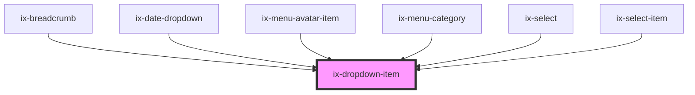

<!-- Auto Generated Below -->

## Properties

| Property          | Attribute           | Description                                                                                   | Type                  | Default     |
| ----------------- | ------------------- | --------------------------------------------------------------------------------------------- | --------------------- | ----------- |
| `ariaLabelButton` | `aria-label-button` | ARIA label for the item's button Will be set as aria-label for the nested HTML button element | `string \| undefined` | `undefined` |
| `ariaLabelIcon`   | `aria-label-icon`   | ARIA label for the icon                                                                       | `string \| undefined` | `undefined` |
| `checked`         | `checked`           | Whether the item is checked or not. If true a checkmark will mark the item as checked.        | `boolean`             | `false`     |
| `disabled`        | `disabled`          | Disable item and remove event listeners                                                       | `boolean`             | `false`     |
| `hover`           | `hover`             | Display hover state                                                                           | `boolean`             | `false`     |
| `icon`            | `icon`              | Icon of dropdown item                                                                         | `string \| undefined` | `undefined` |
| `label`           | `label`             | Label of dropdown item                                                                        | `string \| undefined` | `undefined` |

## Dependencies

### Used by

 - [ix-breadcrumb](../breadcrumb)
 - [ix-date-dropdown](../date-dropdown)
 - [ix-menu-avatar-item](../menu-avatar-item)
 - [ix-menu-category](../menu-category)
 - [ix-select](../select)
 - [ix-select-item](../select-item)

### Graph

----------------------------------------------

*Built with [StencilJS](https://stenciljs.com/)*
