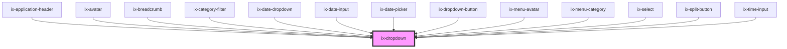

<!-- Auto Generated Below -->

## Properties

| Property                     | Attribute                      | Description                                                                                                                                                                                                                                               | Type                                                                                                                       | Default          |
| ---------------------------- | ------------------------------ | --------------------------------------------------------------------------------------------------------------------------------------------------------------------------------------------------------------------------------------------------------- | -------------------------------------------------------------------------------------------------------------------------- | ---------------- |
| `anchor`                     | `anchor`                       | Define an anchor element                                                                                                                                                                                                                                  | `HTMLElement \| Promise<HTMLElement> \| string \| undefined`                                                               | `undefined`      |
| `closeBehavior`              | `close-behavior`               | Controls if the dropdown will be closed in response to a click event depending on the position of the event relative to the dropdown. If the dropdown is a child of another one, it will be closed with the parent, regardless of its own close behavior. | `"both" \| "inside" \| "outside" \| boolean`                                                                               | `'both'`         |
| `header`                     | `header`                       | An optional header shown at the top of the dropdown                                                                                                                                                                                                       | `string \| undefined`                                                                                                      | `undefined`      |
| `placement`                  | `placement`                    | Placement of the dropdown                                                                                                                                                                                                                                 | `"bottom-end" \| "bottom-start" \| "left-end" \| "left-start" \| "right-end" \| "right-start" \| "top-end" \| "top-start"` | `'bottom-start'` |
| `positioningStrategy`        | `positioning-strategy`         | Position strategy                                                                                                                                                                                                                                         | `"absolute" \| "fixed"`                                                                                                    | `'fixed'`        |
| `show`                       | `show`                         | Show dropdown                                                                                                                                                                                                                                             | `boolean`                                                                                                                  | `false`          |
| `suppressAutomaticPlacement` | `suppress-automatic-placement` | Suppress the automatic placement of the dropdown.                                                                                                                                                                                                         | `boolean`                                                                                                                  | `false`          |
| `trigger`                    | `trigger`                      | Define an element that triggers the dropdown. A trigger can either be a string that will be interpreted as id attribute or a DOM element.                                                                                                                 | `HTMLElement \| Promise<HTMLElement> \| string \| undefined`                                                               | `undefined`      |

## Events

| Event         | Description                                         | Type                   |
| ------------- | --------------------------------------------------- | ---------------------- |
| `showChanged` | Fire event after visibility of dropdown has changed | `CustomEvent<boolean>` |

## Methods

### `updatePosition() => Promise<void>`

Update position of dropdown

#### Returns

Type: `Promise<void>`

## Dependencies

### Used by

 - [ix-application-header](../application-header)
 - [ix-avatar](../avatar)
 - [ix-breadcrumb](../breadcrumb)
 - [ix-category-filter](../category-filter)
 - [ix-date-dropdown](../date-dropdown)
 - [ix-date-input](../date-input)
 - [ix-date-picker](../date-picker)
 - [ix-dropdown-button](../dropdown-button)
 - [ix-menu-avatar](../menu-avatar)
 - [ix-menu-category](../menu-category)
 - [ix-select](../select)
 - [ix-split-button](../split-button)
 - [ix-time-input](../time-input)

### Graph

----------------------------------------------

*Built with [StencilJS](https://stenciljs.com/)*
