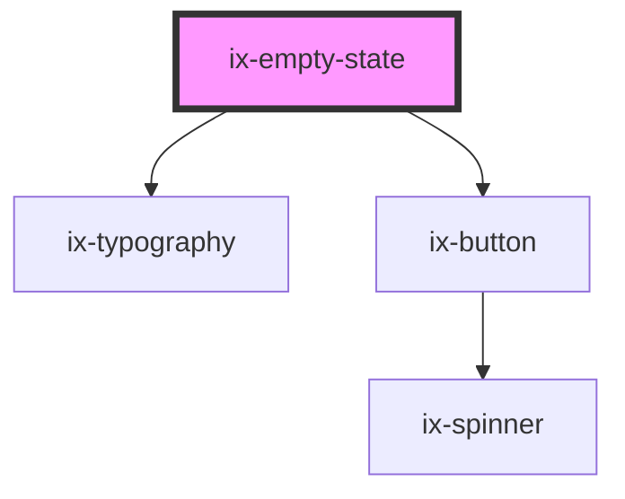

<!-- Auto Generated Below -->

## Properties

| Property                  | Attribute                     | Description                                                               | Type                                     | Default     |
| ------------------------- | ----------------------------- | ------------------------------------------------------------------------- | ---------------------------------------- | ----------- |
| `action`                  | `action`                      | Optional empty state action                                               | `string \| undefined`                    | `undefined` |
| `ariaLabelEmptyStateIcon` | `aria-label-empty-state-icon` | ARIA label for the empty state icon                                       | `string \| undefined`                    | `undefined` |
| `header` _(required)_     | `header`                      | Empty state header                                                        | `string`                                 | `undefined` |
| `icon`                    | `icon`                        | Optional empty state icon                                                 | `string \| undefined`                    | `undefined` |
| `layout`                  | `layout`                      | Optional empty state layout - one of 'large', 'compact' or 'compactBreak' | `"compact" \| "compactBreak" \| "large"` | `'large'`   |
| `subHeader`               | `sub-header`                  | Optional empty state sub header                                           | `string \| undefined`                    | `undefined` |

## Events

| Event         | Description                    | Type                |
| ------------- | ------------------------------ | ------------------- |
| `actionClick` | Empty state action click event | `CustomEvent<void>` |

## Dependencies

### Depends on

- [ix-typography](../typography)
- [ix-button](../button)

### Graph

----------------------------------------------

*Built with [StencilJS](https://stenciljs.com/)*
