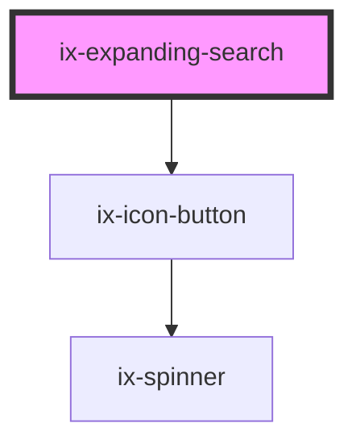

<!-- Auto Generated Below -->

## Properties

| Property                    | Attribute                       | Description                                                                                               | Type                                                                                                                                                                   | Default             |
| --------------------------- | ------------------------------- | --------------------------------------------------------------------------------------------------------- | ---------------------------------------------------------------------------------------------------------------------------------------------------------------------- | ------------------- |
| `ariaLabelClearIconButton`  | `aria-label-clear-icon-button`  | ARIA label for the clear icon button Will be set as aria-label on the nested HTML button element          | `string \| undefined`                                                                                                                                                  | `undefined`         |
| `ariaLabelSearchIconButton` | `aria-label-search-icon-button` | ARIA label for the search icon button Will be set as aria-label on the nested HTML button element         | `string \| undefined`                                                                                                                                                  | `undefined`         |
| `ariaLabelSearchInput`      | `aria-label-search-input`       | ARIA label for the search input Will be set as aria-label on the nested HTML input element                | `string \| undefined`                                                                                                                                                  | `undefined`         |
| `fullWidth`                 | `full-width`                    | If true the search field will fill all available horizontal space of it's parent container when expanded. | `boolean`                                                                                                                                                              | `false`             |
| `icon`                      | `icon`                          | Search icon                                                                                               | `string \| undefined`                                                                                                                                                  | `undefined`         |
| `placeholder`               | `placeholder`                   | Placeholder text                                                                                          | `string`                                                                                                                                                               | `'Enter text here'` |
| `value`                     | `value`                         | Default value                                                                                             | `string`                                                                                                                                                               | `''`                |
| `variant`                   | `variant`                       | button variant                                                                                            | `"danger-primary" \| "danger-secondary" \| "danger-tertiary" \| "primary" \| "secondary" \| "subtle-primary" \| "subtle-secondary" \| "subtle-tertiary" \| "tertiary"` | `'tertiary'`        |

## Events

| Event         | Description   | Type                  |
| ------------- | ------------- | --------------------- |
| `valueChange` | Value changed | `CustomEvent<string>` |

## Dependencies

### Depends on

- [ix-icon-button](../icon-button)

### Graph

----------------------------------------------

*Built with [StencilJS](https://stenciljs.com/)*
