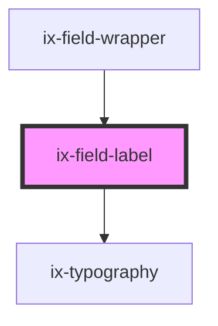

<!-- Auto Generated Below -->

## Properties

| Property   | Attribute  | Description                                                           | Type                   | Default     |
| ---------- | ---------- | --------------------------------------------------------------------- | ---------------------- | ----------- |
| `htmlFor`  | `html-for` | The id of the form element that the label is associated with          | `string \| undefined`  | `undefined` |
| `required` | `required` | A value is required or must be checked for the form to be submittable | `boolean \| undefined` | `undefined` |

## Dependencies

### Used by

 - ix-field-wrapper

### Depends on

- [ix-typography](../typography)

### Graph

----------------------------------------------

*Built with [StencilJS](https://stenciljs.com/)*
