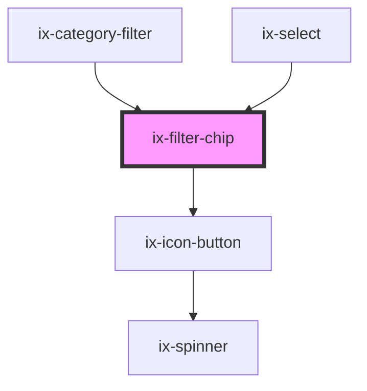

<!-- Auto Generated Below -->

## Properties

| Property                   | Attribute                      | Description                                                                                      | Type                  | Default     |
| -------------------------- | ------------------------------ | ------------------------------------------------------------------------------------------------ | --------------------- | ----------- |
| `ariaLabelCloseIconButton` | `aria-label-close-icon-button` | ARIA label for the close icon button Will be set as aria-label on the nested HTML button element | `string \| undefined` | `undefined` |
| `disabled`                 | `disabled`                     | If true the filter chip will be in disabled state                                                | `boolean`             | `false`     |
| `readonly`                 | `readonly`                     | If true the filter chip will be in readonly mode                                                 | `boolean`             | `false`     |

## Events

| Event        | Description   | Type                |
| ------------ | ------------- | ------------------- |
| `closeClick` | Close clicked | `CustomEvent<void>` |

## Dependencies

### Used by

 - [ix-category-filter](../category-filter)
 - [ix-select](../select)

### Depends on

- [ix-icon-button](../icon-button)

### Graph

----------------------------------------------

*Built with [StencilJS](https://stenciljs.com/)*
