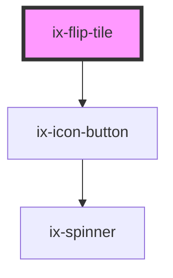

<!-- Auto Generated Below -->

## Properties

| Property                 | Attribute                    | Description                                                                                    | Type                                                                   | Default     |
| ------------------------ | ---------------------------- | ---------------------------------------------------------------------------------------------- | ---------------------------------------------------------------------- | ----------- |
| `ariaLabelEyeIconButton` | `aria-label-eye-icon-button` | ARIA label for the eye icon button Will be set as aria-label on the nested HTML button element | `string \| undefined`                                                  | `undefined` |
| `height`                 | `height`                     | Height interpreted as REM                                                                      | `"auto" \| number`                                                     | `15.125`    |
| `index`                  | `index`                      | Index of the currently visible content                                                         | `number`                                                               | `0`         |
| `variant`                | `variant`                    | Variation of the Flip                                                                          | `"alarm" \| "filled" \| "info" \| "outline" \| "primary" \| "warning"` | `'filled'`  |
| `width`                  | `width`                      | Width interpreted as REM                                                                       | `"auto" \| number`                                                     | `16`        |

## Events

| Event    | Description                          | Type                  |
| -------- | ------------------------------------ | --------------------- |
| `toggle` | Event emitted when the index changes | `CustomEvent<number>` |

## Dependencies

### Depends on

- [ix-icon-button](../icon-button)

### Graph

----------------------------------------------

*Built with [StencilJS](https://stenciljs.com/)*
