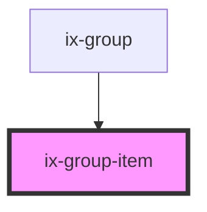

<!-- Auto Generated Below -->

## Properties

| Property            | Attribute            | Description                                                                                                                   | Type                  | Default     |
| ------------------- | -------------------- | ----------------------------------------------------------------------------------------------------------------------------- | --------------------- | ----------- |
| `ariaLabelIcon`     | `aria-label-icon`    | ARIA label for the icon                                                                                                       | `string \| undefined` | `undefined` |
| `disabled`          | `disabled`           | Disable the group item. The elements tabindex attribute will get set accordingly.  If false tabindex will be 0, -1 otherwise. | `boolean`             | `false`     |
| `icon`              | `icon`               | Group item icon                                                                                                               | `string \| undefined` | `undefined` |
| `index`             | `index`              | Index                                                                                                                         | `number \| undefined` | `undefined` |
| `secondaryText`     | `secondary-text`     | Group item secondary text                                                                                                     | `string \| undefined` | `undefined` |
| `selected`          | `selected`           | Show selected state                                                                                                           | `boolean`             | `false`     |
| `suppressSelection` | `suppress-selection` | Supress the selection of the group                                                                                            | `boolean`             | `false`     |
| `text`              | `text`               | Group item text                                                                                                               | `string \| undefined` | `undefined` |

## Events

| Event             | Description       | Type                                  |
| ----------------- | ----------------- | ------------------------------------- |
| `selectedChanged` | Selection changed | `CustomEvent<HTMLIxGroupItemElement>` |

## Dependencies

### Used by

 - [ix-group](../group)

### Graph

----------------------------------------------

*Built with [StencilJS](https://stenciljs.com/)*
