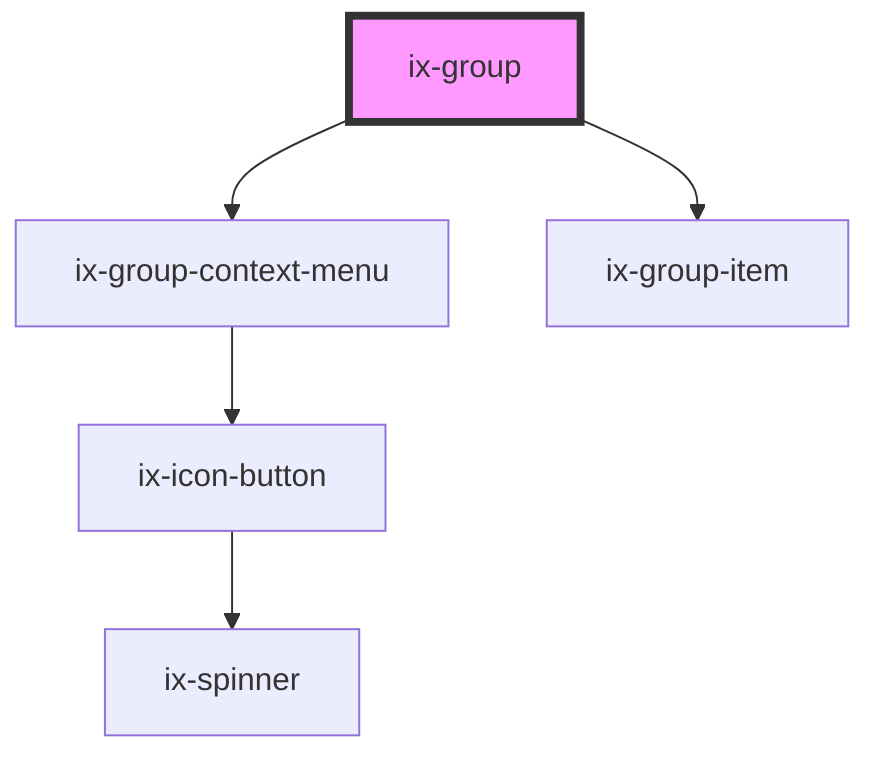

<!-- Auto Generated Below -->

## Properties

| Property                  | Attribute                   | Description                                                                    | Type                  | Default     |
| ------------------------- | --------------------------- | ------------------------------------------------------------------------------ | --------------------- | ----------- |
| `expandOnHeaderClick`     | `expand-on-header-click`    | Expand the group if the header is clicked                                      | `boolean`             | `false`     |
| `expanded`                | `expanded`                  | Whether the group is expanded or collapsed. Defaults to false.                 | `boolean`             | `false`     |
| `header`                  | `header`                    | Group header                                                                   | `string \| undefined` | `undefined` |
| `index`                   | `index`                     | The index of the selected group entry. If undefined no group item is selected. | `number \| undefined` | `undefined` |
| `selected`                | `selected`                  | Whether the group is selected.                                                 | `boolean`             | `false`     |
| `subHeader`               | `sub-header`                | Group header subtitle                                                          | `string \| undefined` | `undefined` |
| `suppressHeaderSelection` | `suppress-header-selection` | Prevent header from being selectable                                           | `boolean`             | `false`     |

## Events

| Event             | Description                           | Type                   |
| ----------------- | ------------------------------------- | ---------------------- |
| `expandedChanged` | Group expanded                        | `CustomEvent<boolean>` |
| `selectGroup`     | Emits when whole group gets selected. | `CustomEvent<boolean>` |
| `selectItem`      | Emits when group item gets selected.  | `CustomEvent<number>`  |

## Dependencies

### Depends on

- [ix-group-context-menu](.)
- [ix-group-item](../group-item)

### Graph

----------------------------------------------

*Built with [StencilJS](https://stenciljs.com/)*
