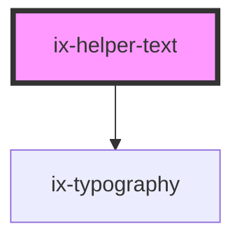

<!-- Auto Generated Below -->

## Properties

| Property      | Attribute      | Description                                                  | Type                  | Default     |
| ------------- | -------------- | ------------------------------------------------------------ | --------------------- | ----------- |
| `helperText`  | `helper-text`  | Show text below the field component                          | `string \| undefined` | `undefined` |
| `htmlFor`     | `html-for`     | The id of the form element that the label is associated with | `string \| undefined` | `undefined` |
| `infoText`    | `info-text`    | Info text for the field component                            | `string \| undefined` | `undefined` |
| `invalidText` | `invalid-text` | Error text for the field component                           | `string \| undefined` | `undefined` |
| `validText`   | `valid-text`   | Valid text for the field component                           | `string \| undefined` | `undefined` |
| `warningText` | `warning-text` | Warning text for the field component                         | `string \| undefined` | `undefined` |

## Dependencies

### Depends on

- [ix-typography](../typography)

### Graph

----------------------------------------------

*Built with [StencilJS](https://stenciljs.com/)*
