<!-- Auto Generated Below -->

## Properties

| Property    | Attribute    | Description                                                                                                                                                                                                                                           | Type                                                                                                                                                                   | Default            |
| ----------- | ------------ | ----------------------------------------------------------------------------------------------------------------------------------------------------------------------------------------------------------------------------------------------------- | ---------------------------------------------------------------------------------------------------------------------------------------------------------------------- | ------------------ |
| `a11yLabel` | `a11y-label` | **[DEPRECATED]** Set the native `aria-label` on the ix-icon-button host element. Will be removed in 5.0.0  Accessibility label for the icon button Will be set as aria-label on the nested HTML button element | `string \| undefined`                                                                                                                                                  | `undefined`        |
| `disabled`  | `disabled`   | Disabled                                                                                                                                                                                                                                              | `boolean`                                                                                                                                                              | `false`            |
| `icon`      | `icon`       | Icon name                                                                                                                                                                                                                                             | `string \| undefined`                                                                                                                                                  | `undefined`        |
| `iconColor` | `icon-color` | Color of icon in  button                                                                                                                                                                                                                              | `string \| undefined`                                                                                                                                                  | `undefined`        |
| `loading`   | `loading`    | Loading button                                                                                                                                                                                                                                        | `boolean`                                                                                                                                                              | `false`            |
| `oval`      | `oval`       | Button in oval shape                                                                                                                                                                                                                                  | `boolean`                                                                                                                                                              | `false`            |
| `size`      | `size`       | Size of icon in button                                                                                                                                                                                                                                | `"12" \| "16" \| "24"`                                                                                                                                                 | `'24'`             |
| `type`      | `type`       | Type of the button                                                                                                                                                                                                                                    | `"button" \| "submit"`                                                                                                                                                 | `'button'`         |
| `variant`   | `variant`    | Variant of button                                                                                                                                                                                                                                     | `"danger-primary" \| "danger-secondary" \| "danger-tertiary" \| "primary" \| "secondary" \| "subtle-primary" \| "subtle-secondary" \| "subtle-tertiary" \| "tertiary"` | `'subtle-primary'` |

## Dependencies

### Used by

 - [ix-application-header](../application-header)
 - [ix-card-list](../card-list)
 - [ix-category-filter](../category-filter)
 - [ix-chip](../chip)
 - [ix-content-header](../content-header)
 - [ix-date-input](../date-input)
 - [ix-date-picker](../date-picker)
 - [ix-drawer](../drawer)
 - [ix-dropdown-button](../dropdown-button)
 - [ix-expanding-search](../expanding-search)
 - [ix-filter-chip](../filter-chip)
 - [ix-flip-tile](../flip-tile)
 - [ix-group-context-menu](../group)
 - [ix-input](../input)
 - [ix-menu](../menu)
 - [ix-menu-about](../menu-about)
 - [ix-menu-about-news](../menu-about-news)
 - ix-menu-expand-icon
 - [ix-menu-settings](../menu-settings)
 - [ix-message-bar](../message-bar)
 - [ix-modal-header](../modal-header)
 - [ix-number-input](../input)
 - [ix-pagination](../pagination)
 - [ix-pane](../pane)
 - [ix-select](../select)
 - [ix-split-button](../split-button)
 - [ix-time-input](../time-input)
 - [ix-toast](../toast)

### Depends on

- [ix-spinner](../spinner)

### Graph

```mermaid
graph TD;
  ix-icon-button --> ix-spinner
  ix-application-header --> ix-icon-button
  ix-card-list --> ix-icon-button
  ix-category-filter --> ix-icon-button
  ix-chip --> ix-icon-button
  ix-content-header --> ix-icon-button
  ix-date-input --> ix-icon-button
  ix-date-picker --> ix-icon-button
  ix-drawer --> ix-icon-button
  ix-dropdown-button --> ix-icon-button
  ix-expanding-search --> ix-icon-button
  ix-filter-chip --> ix-icon-button
  ix-flip-tile --> ix-icon-button
  ix-group-context-menu --> ix-icon-button
  ix-input --> ix-icon-button
  ix-menu --> ix-icon-button
  ix-menu-about --> ix-icon-button
  ix-menu-about-news --> ix-icon-button
  ix-menu-expand-icon --> ix-icon-button
  ix-menu-settings --> ix-icon-button
  ix-message-bar --> ix-icon-button
  ix-modal-header --> ix-icon-button
  ix-number-input --> ix-icon-button
  ix-pagination --> ix-icon-button
  ix-pane --> ix-icon-button
  ix-select --> ix-icon-button
  ix-split-button --> ix-icon-button
  ix-time-input --> ix-icon-button
  ix-toast --> ix-icon-button
  style ix-icon-button fill:#f9f,stroke:#333,stroke-width:4px
```

----------------------------------------------

*Built with [StencilJS](https://stenciljs.com/)*
