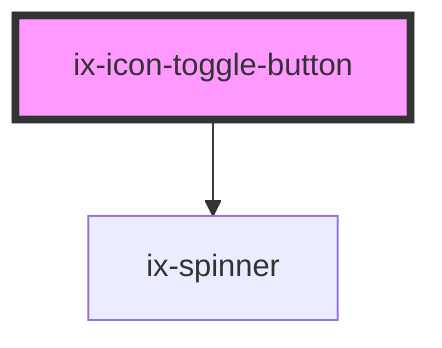

<!-- Auto Generated Below -->

## Properties

| Property              | Attribute                | Description                                                                   | Type                                                                                                                                                                   | Default            |
| --------------------- | ------------------------ | ----------------------------------------------------------------------------- | ---------------------------------------------------------------------------------------------------------------------------------------------------------------------- | ------------------ |
| `ariaLabelIconButton` | `aria-label-icon-button` | ARIA label for the icon button Will be set for the native HTML button element | `string \| undefined`                                                                                                                                                  | `undefined`        |
| `disabled`            | `disabled`               | Disable the button                                                            | `boolean`                                                                                                                                                              | `false`            |
| `ghost`               | `ghost`                  | Button with no background or outline                                          | `boolean`                                                                                                                                                              | `false`            |
| `icon`                | `icon`                   | Icon name                                                                     | `string \| undefined`                                                                                                                                                  | `undefined`        |
| `loading`             | `loading`                | Loading button                                                                | `boolean`                                                                                                                                                              | `false`            |
| `outline`             | `outline`                | Outline button                                                                | `boolean`                                                                                                                                                              | `false`            |
| `oval`                | `oval`                   | Button in oval shape                                                          | `boolean`                                                                                                                                                              | `false`            |
| `pressed`             | `pressed`                | Show button as pressed                                                        | `boolean`                                                                                                                                                              | `false`            |
| `size`                | `size`                   | Size of icon in button                                                        | `"12" \| "16" \| "24"`                                                                                                                                                 | `'24'`             |
| `variant`             | `variant`                | Button variant.                                                               | `"danger-primary" \| "danger-secondary" \| "danger-tertiary" \| "primary" \| "secondary" \| "subtle-primary" \| "subtle-secondary" \| "subtle-tertiary" \| "tertiary"` | `'subtle-primary'` |

## Events

| Event           | Description          | Type                   |
| --------------- | -------------------- | ---------------------- |
| `pressedChange` | Pressed change event | `CustomEvent<boolean>` |

## Dependencies

### Depends on

- [ix-spinner](../spinner)

### Graph

----------------------------------------------

*Built with [StencilJS](https://stenciljs.com/)*
