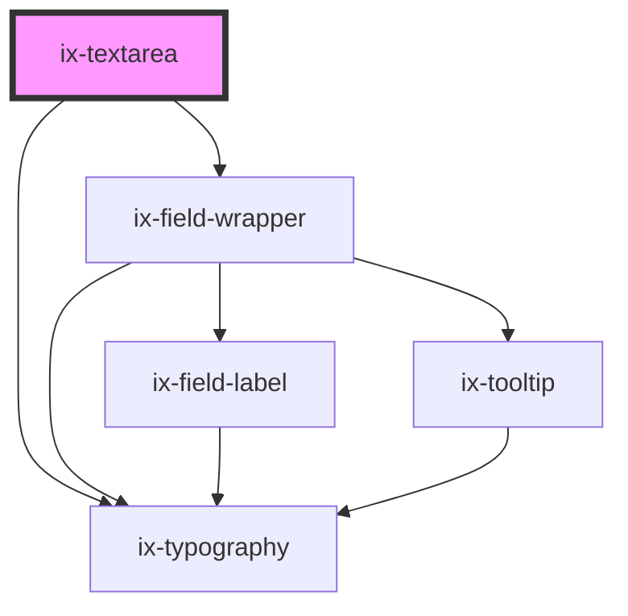

<!-- Auto Generated Below -->

## Properties

| Property            | Attribute              | Description                                                                                                                             | Type                                             | Default     |
| ------------------- | ---------------------- | --------------------------------------------------------------------------------------------------------------------------------------- | ------------------------------------------------ | ----------- |
| `disabled`          | `disabled`             | Determines if the textarea field is disabled.                                                                                           | `boolean`                                        | `false`     |
| `helperText`        | `helper-text`          | The helper text for the textarea field.                                                                                                 | `string \| undefined`                            | `undefined` |
| `infoText`          | `info-text`            | The info text for the textarea field.                                                                                                   | `string \| undefined`                            | `undefined` |
| `invalidText`       | `invalid-text`         | The error text for the textarea field.                                                                                                  | `string \| undefined`                            | `undefined` |
| `label`             | `label`                | The label for the textarea field.                                                                                                       | `string \| undefined`                            | `undefined` |
| `maxLength`         | `max-length`           | The maximum length of the textarea field.                                                                                               | `number \| undefined`                            | `undefined` |
| `minLength`         | `min-length`           | The minimum length of the textarea field.                                                                                               | `number \| undefined`                            | `undefined` |
| `name`              | `name`                 | The name of the textarea field.                                                                                                         | `string \| undefined`                            | `undefined` |
| `placeholder`       | `placeholder`          | The placeholder text for the textarea field.                                                                                            | `string \| undefined`                            | `undefined` |
| `readonly`          | `readonly`             | Determines if the textarea field is readonly.                                                                                           | `boolean`                                        | `false`     |
| `required`          | `required`             | Determines if the textarea field is required.                                                                                           | `boolean`                                        | `false`     |
| `resizeBehavior`    | `resize-behavior`      | Determines the resize behavior of the textarea field. Resizing can be enabled in one direction, both directions or completely disabled. | `"both" \| "horizontal" \| "none" \| "vertical"` | `'both'`    |
| `showTextAsTooltip` | `show-text-as-tooltip` | Determines if the text should be displayed as a tooltip.                                                                                | `boolean \| undefined`                           | `undefined` |
| `textareaCols`      | `textarea-cols`        | The width of the textarea specified by number of characters.                                                                            | `number \| undefined`                            | `undefined` |
| `textareaHeight`    | `textarea-height`      | The height of the textarea field (e.g. "52px").                                                                                         | `string \| undefined`                            | `undefined` |
| `textareaRows`      | `textarea-rows`        | The height of the textarea specified by number of rows.                                                                                 | `number \| undefined`                            | `undefined` |
| `textareaWidth`     | `textarea-width`       | The width of the textarea field (e.g. "200px").                                                                                         | `string \| undefined`                            | `undefined` |
| `validText`         | `valid-text`           | The valid text for the textarea field.                                                                                                  | `string \| undefined`                            | `undefined` |
| `value`             | `value`                | The value of the textarea field.                                                                                                        | `string`                                         | `''`        |
| `warningText`       | `warning-text`         | The warning text for the textarea field.                                                                                                | `string \| undefined`                            | `undefined` |

## Events

| Event                 | Description                                                          | Type                         |
| --------------------- | -------------------------------------------------------------------- | ---------------------------- |
| `ixBlur`              | Event emitted when the textarea field loses focus.                   | `CustomEvent<void>`          |
| `validityStateChange` | Event emitted when the validity state of the textarea field changes. | `CustomEvent<ValidityState>` |
| `valueChange`         | Event emitted when the value of the textarea field changes.          | `CustomEvent<string>`        |

## Methods

### `focusInput() => Promise<void>`

Focuses the input field

#### Returns

Type: `Promise<void>`

### `getNativeInputElement() => Promise<HTMLTextAreaElement>`

Get the native textarea element.

#### Returns

Type: `Promise<HTMLTextAreaElement>`

## Dependencies

### Depends on

- ix-field-wrapper
- [ix-typography](../typography)

### Graph

----------------------------------------------

*Built with [StencilJS](https://stenciljs.com/)*
