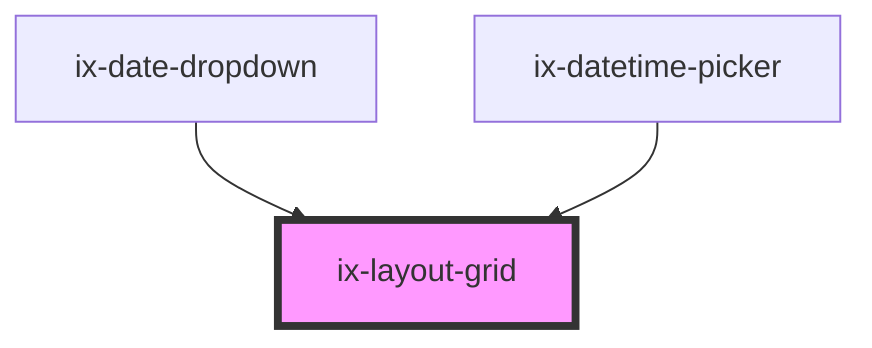

<!-- Auto Generated Below -->

## Properties

| Property   | Attribute   | Description                                                               | Type                          | Default |
| ---------- | ----------- | ------------------------------------------------------------------------- | ----------------------------- | ------- |
| `columns`  | `columns`   | Overwrite the default number of columns. Choose between 2 and 12 columns. | `number`                      | `12`    |
| `gap`      | `gap`       | Grid gap                                                                  | `"12" \| "16" \| "24" \| "8"` | `'24'`  |
| `noMargin` | `no-margin` | The grid will not have any horizontal padding                             | `boolean`                     | `false` |

## Dependencies

### Used by

 - [ix-date-dropdown](../date-dropdown)
 - [ix-datetime-picker](../datetime-picker)

### Graph

----------------------------------------------

*Built with [StencilJS](https://stenciljs.com/)*
