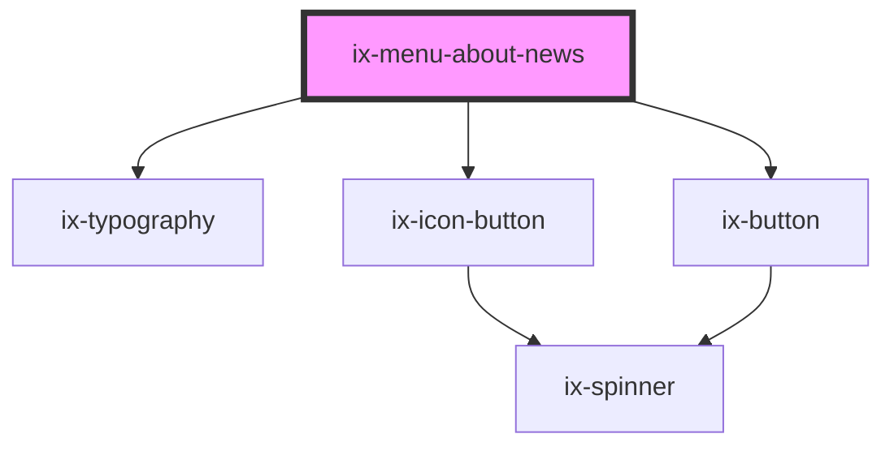

<!-- Auto Generated Below -->

## Properties

| Property         | Attribute          | Description                       | Type                  | Default       |
| ---------------- | ------------------ | --------------------------------- | --------------------- | ------------- |
| `aboutItemLabel` | `about-item-label` | Subtitle of the about news        | `string \| undefined` | `undefined`   |
| `i18nShowMore`   | `i18n-show-more`   | i18n label for 'Show more' button | `string`              | `'Show more'` |
| `label`          | `label`            | Title of the about news           | `string \| undefined` | `undefined`   |
| `show`           | `show`             | Show about news                   | `boolean`             | `false`       |

## Events

| Event          | Description                 | Type                      |
| -------------- | --------------------------- | ------------------------- |
| `closePopover` | Popover closed              | `CustomEvent<void>`       |
| `showMore`     | Show More button is pressed | `CustomEvent<MouseEvent>` |

## Dependencies

### Depends on

- [ix-typography](../typography)
- [ix-icon-button](../icon-button)
- [ix-button](../button)

### Graph

----------------------------------------------

*Built with [StencilJS](https://stenciljs.com/)*
