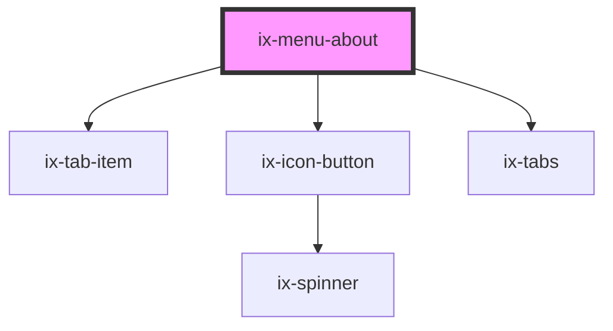

<!-- Auto Generated Below -->

## Properties

| Property         | Attribute          | Description           | Type                  | Default                       |
| ---------------- | ------------------ | --------------------- | --------------------- | ----------------------------- |
| `activeTabLabel` | `active-tab-label` | Active tab            | `string \| undefined` | `undefined`                   |
| `label`          | `label`            | Content of the header | `string`              | `'About & legal information'` |

## Events

| Event       | Description            | Type                            |
| ----------- | ---------------------- | ------------------------------- |
| `close`     | About and Legal closed | `CustomEvent<CustomCloseEvent>` |
| `tabChange` | Active tab changed     | `CustomEvent<string>`           |

## Dependencies

### Depends on

- [ix-tab-item](../tab-item)
- [ix-icon-button](../icon-button)
- [ix-tabs](../tabs)

### Graph

----------------------------------------------

*Built with [StencilJS](https://stenciljs.com/)*
