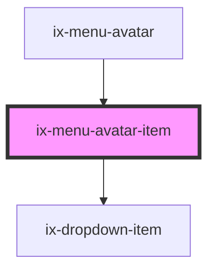

<!-- Auto Generated Below -->

## Properties

| Property | Attribute | Description           | Type                  | Default     |
| -------- | --------- | --------------------- | --------------------- | ----------- |
| `icon`   | `icon`    | Avatar dropdown icon  | `string \| undefined` | `undefined` |
| `label`  | `label`   | Avatar dropdown label | `string \| undefined` | `undefined` |

## Events

| Event       | Description                  | Type                      |
| ----------- | ---------------------------- | ------------------------- |
| `itemClick` | Avatar dropdown item clicked | `CustomEvent<MouseEvent>` |

## Dependencies

### Used by

 - [ix-menu-avatar](../menu-avatar)

### Depends on

- [ix-dropdown-item](../dropdown-item)

### Graph

----------------------------------------------

*Built with [StencilJS](https://stenciljs.com/)*
