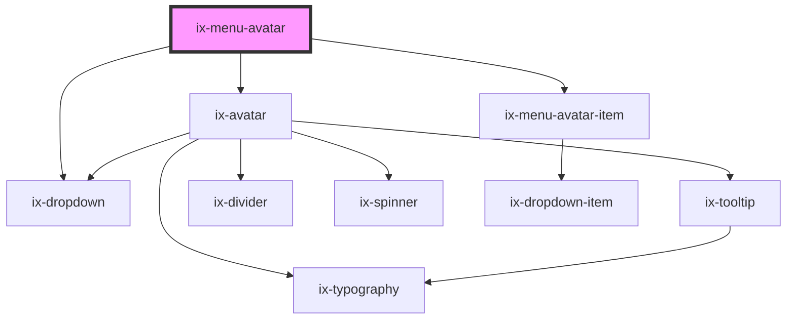

<!-- Auto Generated Below -->

## Properties

| Property           | Attribute            | Description                                                    | Type                  | Default     |
| ------------------ | -------------------- | -------------------------------------------------------------- | --------------------- | ----------- |
| `bottom`           | `bottom`             | Second line of text                                            | `string \| undefined` | `undefined` |
| `hideLogoutButton` | `hide-logout-button` | Control the visibility of the logout button                    | `boolean`             | `false`     |
| `i18nLogout`       | `i18n-logout`        | i18n label for 'Logout' button                                 | `string`              | `'Logout'`  |
| `image`            | `image`              | Display a avatar image                                         | `string \| undefined` | `undefined` |
| `initials`         | `initials`           | Display the initials of the user. Will be overwritten by image | `string \| undefined` | `undefined` |
| `top`              | `top`                | First line of text                                             | `string \| undefined` | `undefined` |

## Events

| Event         | Description  | Type               |
| ------------- | ------------ | ------------------ |
| `logoutClick` | Logout click | `CustomEvent<any>` |

## Dependencies

### Depends on

- [ix-avatar](../avatar)
- [ix-dropdown](../dropdown)
- [ix-menu-avatar-item](../menu-avatar-item)

### Graph

----------------------------------------------

*Built with [StencilJS](https://stenciljs.com/)*
