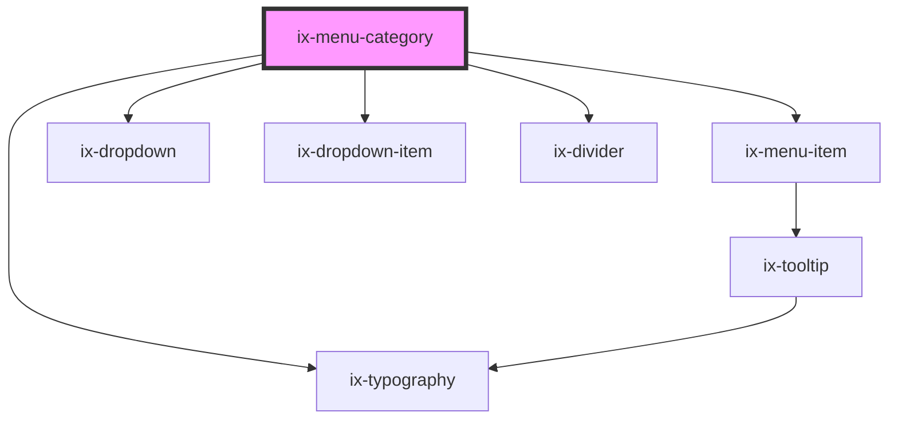

<!-- Auto Generated Below -->

## Properties

| Property        | Attribute       | Description                                                                    | Type                  | Default     |
| --------------- | --------------- | ------------------------------------------------------------------------------ | --------------------- | ----------- |
| `icon`          | `icon`          | Icon of the category                                                           | `string \| undefined` | `undefined` |
| `label`         | `label`         | Display name of the category                                                   | `string \| undefined` | `undefined` |
| `notifications` | `notifications` | Show notification count on the category                                        | `number \| undefined` | `undefined` |
| `tooltipText`   | `tooltip-text`  | Will be shown as tooltip text, if not provided menu text content will be used. | `string \| undefined` | `undefined` |

## Dependencies

### Depends on

- [ix-menu-item](../menu-item)
- [ix-dropdown](../dropdown)
- [ix-dropdown-item](../dropdown-item)
- [ix-typography](../typography)
- [ix-divider](../divider)

### Graph

----------------------------------------------

*Built with [StencilJS](https://stenciljs.com/)*
