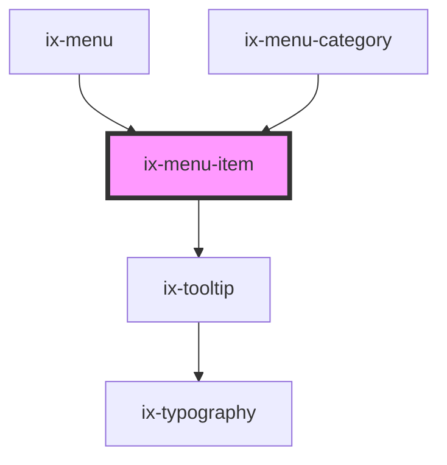

<!-- Auto Generated Below -->

## Properties

| Property        | Attribute       | Description                                                                                                                                   | Type                                                      | Default     |
| --------------- | --------------- | --------------------------------------------------------------------------------------------------------------------------------------------- | --------------------------------------------------------- | ----------- |
| `active`        | `active`        | State to display active                                                                                                                       | `boolean`                                                 | `false`     |
| `bottom`        | `bottom`        | Caution: this is no longer working. Please use slot="bottom" instead.  Place tab on bottom                                                    | `boolean`                                                 | `false`     |
| `disabled`      | `disabled`      | Disable tab and remove event handlers                                                                                                         | `boolean`                                                 | `false`     |
| `home`          | `home`          | Move the Tab to a top position.                                                                                                               | `boolean`                                                 | `false`     |
| `href`          | `href`          | URL for the button link. When provided, the button will render as an anchor tag.                                                              | `string \| undefined`                                     | `undefined` |
| `icon`          | `icon`          | Name of the icon you want to display. Icon names can be resolved from the documentation {@link https://ix.siemens.io/docs/icon-library/icons} | `string \| undefined`                                     | `undefined` |
| `label`         | `label`         | Label of the menu item. Will also be used as tooltip text                                                                                     | `string \| undefined`                                     | `undefined` |
| `notifications` | `notifications` | Show notification count on tab                                                                                                                | `number \| undefined`                                     | `undefined` |
| `rel`           | `rel`           | Specifies the relationship between the current document and the linked document when href is provided.                                        | `string \| undefined`                                     | `undefined` |
| `target`        | `target`        | Specifies where to open the linked document when href is provided.                                                                            | `"_blank" \| "_parent" \| "_self" \| "_top" \| undefined` | `'_self'`   |
| `tooltipText`   | `tooltip-text`  | Will be shown as tooltip text, if not provided menu text content will be used.                                                                | `string \| undefined`                                     | `undefined` |

## Slots

| Slot                             | Description |
| -------------------------------- | ----------- |
| `"menu-item-label Custom label"` |             |

## Dependencies

### Used by

 - [ix-menu](../menu)
 - [ix-menu-category](../menu-category)

### Depends on

- [ix-tooltip](../tooltip)

### Graph

----------------------------------------------

*Built with [StencilJS](https://stenciljs.com/)*
