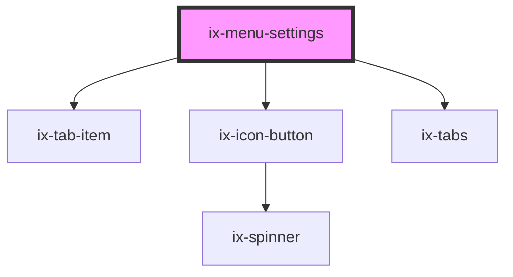

<!-- Auto Generated Below -->

## Properties

| Property         | Attribute          | Description        | Type                  | Default      |
| ---------------- | ------------------ | ------------------ | --------------------- | ------------ |
| `activeTabLabel` | `active-tab-label` | Active tab         | `string \| undefined` | `undefined`  |
| `label`          | `label`            | Label of first tab | `string`              | `'Settings'` |

## Events

| Event       | Description        | Type                            |
| ----------- | ------------------ | ------------------------------- |
| `close`     | Popover closed     | `CustomEvent<CustomCloseEvent>` |
| `tabChange` | Active tab changed | `CustomEvent<string>`           |

## Dependencies

### Depends on

- [ix-tab-item](../tab-item)
- [ix-icon-button](../icon-button)
- [ix-tabs](../tabs)

### Graph

----------------------------------------------

*Built with [StencilJS](https://stenciljs.com/)*
