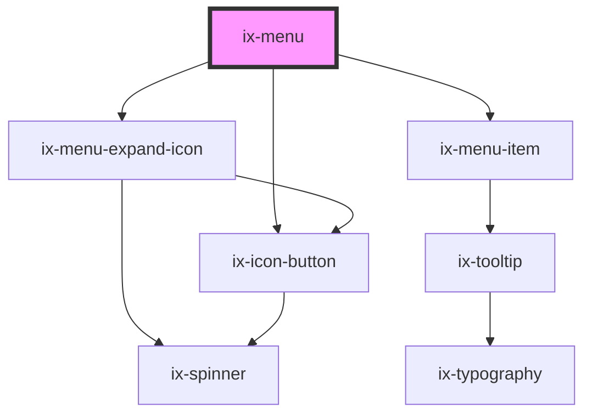

<!-- Auto Generated Below -->

## Properties

| Property                 | Attribute                 | Description                                                                                    | Type                  | Default                       |
| ------------------------ | ------------------------- | ---------------------------------------------------------------------------------------------- | --------------------- | ----------------------------- |
| `applicationDescription` | `application-description` | Should only be set if you use ix-menu standalone                                               | `string`              | `''`                          |
| `applicationName`        | `application-name`        | Should only be set if you use ix-menu standalone                                               | `string \| undefined` | `undefined`                   |
| `enableToggleTheme`      | `enable-toggle-theme`     | Show toggle between light and dark variant. Only if the provided theme have implemented both!  | `boolean`             | `false`                       |
| `expand`                 | `expand`                  | Toggle the expand state of the menu                                                            | `boolean`             | `false`                       |
| `i18nCollapse`           | `i18n-collapse`           | i18n label for 'Collapse' button                                                               | `string`              | `'Collapse'`                  |
| `i18nExpand`             | `i18n-expand`             | i18n label for 'Expand' button                                                                 | `string`              | `' Expand'`                   |
| `i18nExpandSidebar`      | `i18n-expand-sidebar`     | Accessibility i18n label for the burger menu of the sidebar                                    | `string`              | `'Expand sidebar'`            |
| `i18nLegal`              | `i18n-legal`              | i18n label for 'About & legal information' button                                              | `string`              | `'About & legal information'` |
| `i18nSettings`           | `i18n-settings`           | i18n label for 'Settings' button                                                               | `string`              | `'Settings'`                  |
| `i18nToggleTheme`        | `i18n-toggle-theme`       | i18n label for 'Toggle theme' button                                                           | `string`              | `'Toggle theme'`              |
| `pinned`                 | `pinned`                  | Menu stays pinned to the left                                                                  | `boolean`             | `false`                       |
| `showAbout`              | `show-about`              | Is about tab visible                                                                           | `boolean`             | `false`                       |
| `showSettings`           | `show-settings`           | Is settings tab visible                                                                        | `boolean`             | `false`                       |
| `startExpanded`          | `start-expanded`          | If set the menu will be expanded initially. This will only take effect at the breakpoint 'lg'. | `boolean`             | `false`                       |

## Events

| Event             | Description                                         | Type                   |
| ----------------- | --------------------------------------------------- | ---------------------- |
| `expandChange`    | Menu expanded                                       | `CustomEvent<boolean>` |
| `mapExpandChange` | Map Sidebar expanded                                | `CustomEvent<boolean>` |
| `openAbout`       | Event emitted when the about button is clicked      | `CustomEvent<void>`    |
| `openAppSwitch`   | Event emitted when the app switch button is clicked | `CustomEvent<void>`    |
| `openSettings`    | Event emitted when the settings button is clicked   | `CustomEvent<void>`    |

## Methods

### `toggleAbout(show: boolean) => Promise<void>`

Toggle About tabs

#### Parameters

| Name   | Type      | Description |
| ------ | --------- | ----------- |
| `show` | `boolean` |             |

#### Returns

Type: `Promise<void>`

### `toggleMapExpand(show?: boolean) => Promise<void>`

Toggle map sidebar expand

#### Parameters

| Name   | Type                   | Description |
| ------ | ---------------------- | ----------- |
| `show` | `boolean \| undefined` |             |

#### Returns

Type: `Promise<void>`

### `toggleMenu(show?: boolean) => Promise<void>`

Toggle menu

#### Parameters

| Name   | Type                   | Description |
| ------ | ---------------------- | ----------- |
| `show` | `boolean \| undefined` |             |

#### Returns

Type: `Promise<void>`

### `toggleSettings(show: boolean) => Promise<void>`

Toggle Settings tabs

#### Parameters

| Name   | Type      | Description |
| ------ | --------- | ----------- |
| `show` | `boolean` |             |

#### Returns

Type: `Promise<void>`

## Dependencies

### Depends on

- ix-menu-expand-icon
- [ix-icon-button](../icon-button)
- [ix-menu-item](../menu-item)

### Graph

----------------------------------------------

*Built with [StencilJS](https://stenciljs.com/)*
