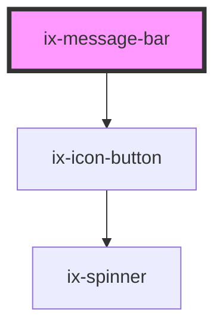

<!-- Auto Generated Below -->

## Properties

| Property     | Attribute    | Description                                                                 | Type                                                                                  | Default  |
| ------------ | ------------ | --------------------------------------------------------------------------- | ------------------------------------------------------------------------------------- | -------- |
| `persistent` | `persistent` | If true, close button is disabled and alert cannot be dismissed by the user | `boolean`                                                                             | `false`  |
| `type`       | `type`       | Specifies the type of the alert.                                            | `"alarm" \| "critical" \| "info" \| "neutral" \| "primary" \| "success" \| "warning"` | `'info'` |

## Events

| Event                     | Description                                            | Type               |
| ------------------------- | ------------------------------------------------------ | ------------------ |
| `closeAnimationCompleted` | An event emitted when the close animation is completed | `CustomEvent<any>` |
| `closedChange`            | An event emitted when the close button is clicked      | `CustomEvent<any>` |

## Dependencies

### Depends on

- [ix-icon-button](../icon-button)

### Graph

----------------------------------------------

*Built with [StencilJS](https://stenciljs.com/)*
