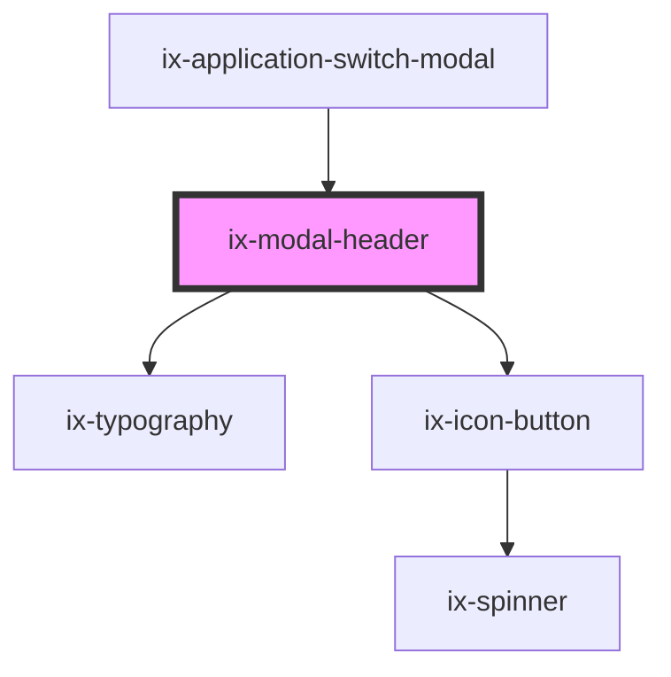

<!-- Auto Generated Below -->

## Properties

| Property                   | Attribute                      | Description                                                                                      | Type                  | Default     |
| -------------------------- | ------------------------------ | ------------------------------------------------------------------------------------------------ | --------------------- | ----------- |
| `ariaLabelCloseIconButton` | `aria-label-close-icon-button` | ARIA label for the close icon button Will be set as aria-label on the nested HTML button element | `string \| undefined` | `undefined` |
| `ariaLabelIcon`            | `aria-label-icon`              | ARIA label for the icon                                                                          | `string \| undefined` | `undefined` |
| `hideClose`                | `hide-close`                   | Hide the close button                                                                            | `boolean`             | `false`     |
| `icon`                     | `icon`                         | Icon of the Header                                                                               | `string \| undefined` | `undefined` |
| `iconColor`                | `icon-color`                   | Icon color                                                                                       | `string \| undefined` | `undefined` |

## Events

| Event        | Description                                                                                                                                   | Type                      |
| ------------ | --------------------------------------------------------------------------------------------------------------------------------------------- | ------------------------- |
| `closeClick` | Emits when close icon is clicked and closes the modal Can be prevented, in which case only the event is triggered, and the modal remains open | `CustomEvent<MouseEvent>` |

## Dependencies

### Used by

 - ix-application-switch-modal

### Depends on

- [ix-typography](../typography)
- [ix-icon-button](../icon-button)

### Graph

----------------------------------------------

*Built with [StencilJS](https://stenciljs.com/)*
