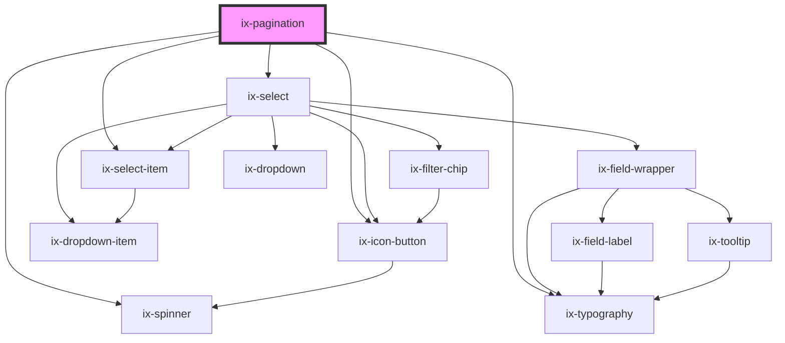

<!-- Auto Generated Below -->

## Properties

| Property                          | Attribute                              | Description                                                                                              | Type                  | Default     |
| --------------------------------- | -------------------------------------- | -------------------------------------------------------------------------------------------------------- | --------------------- | ----------- |
| `advanced`                        | `advanced`                             | Advanced mode                                                                                            | `boolean`             | `false`     |
| `ariaLabelChevronLeftIconButton`  | `aria-label-chevron-left-icon-button`  | ARIA label for the chevron left icon button Will be set as aria-label on the nested HTML button element  | `string \| undefined` | `undefined` |
| `ariaLabelChevronRightIconButton` | `aria-label-chevron-right-icon-button` | ARIA label for the chevron right icon button Will be set as aria-label on the nested HTML button element | `string \| undefined` | `undefined` |
| `count`                           | `count`                                | Total number of pages                                                                                    | `number`              | `0`         |
| `hideItemCount`                   | `hide-item-count`                      | Hide item count in advanced mode                                                                         | `boolean`             | `false`     |
| `i18nItems`                       | `i18n-items`                           | i18n label for 'Items'                                                                                   | `string`              | `'Items'`   |
| `i18nOf`                          | `i18n-of`                              | i18n label for 'of'                                                                                      | `string`              | `'of'`      |
| `i18nPage`                        | `i18n-page`                            | i18n label for 'Page'                                                                                    | `string`              | `'Page'`    |
| `itemCount`                       | `item-count`                           | Number of items shown at once. Can only be changed in advaced mode.                                      | `number`              | `15`        |
| `selectedPage`                    | `selected-page`                        | Zero based index of currently selected page                                                              | `number`              | `0`         |

## Events

| Event              | Description             | Type                  |
| ------------------ | ----------------------- | --------------------- |
| `itemCountChanged` | Item count change event | `CustomEvent<number>` |
| `pageSelected`     | Page selection event    | `CustomEvent<number>` |

## Dependencies

### Depends on

- [ix-icon-button](../icon-button)
- [ix-typography](../typography)
- [ix-select](../select)
- [ix-select-item](../select-item)
- [ix-spinner](../spinner)

### Graph

----------------------------------------------

*Built with [StencilJS](https://stenciljs.com/)*
