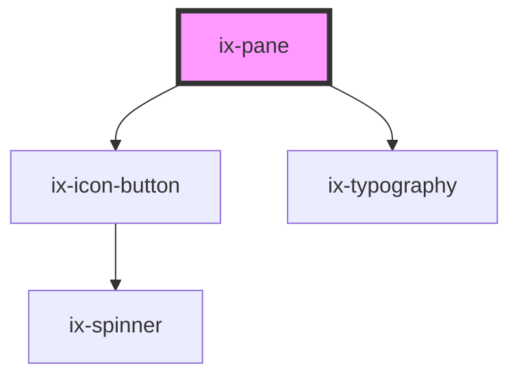

<!-- Auto Generated Below -->

## Properties

| Property                       | Attribute                          | Description                                                                                                                                                       | Type                                                                    | Default     |
| ------------------------------ | ---------------------------------- | ----------------------------------------------------------------------------------------------------------------------------------------------------------------- | ----------------------------------------------------------------------- | ----------- |
| `ariaLabelCollapseCloseButton` | `aria-label-collapse-close-button` | ARIA label close or collapse button                                                                                                                               | `string \| undefined`                                                   | `undefined` |
| `ariaLabelIcon`                | `aria-label-icon`                  | ARIA label for the icon                                                                                                                                           | `string \| undefined`                                                   | `undefined` |
| `borderless`                   | `borderless`                       | Toggle the border of the pane. Defaults to the borderless attribute of the pane layout. If used standalone it defaults to false.                                  | `boolean`                                                               | `false`     |
| `closeOnClickOutside`          | `close-on-click-outside`           | If true, the pane will close when clicking outside of it                                                                                                          | `boolean`                                                               | `false`     |
| `composition`                  | `composition`                      | Defines the position of the pane inside it's container. Inside a pane layout this property will automatically be set to the name of slot the pane is assigned to. | `"bottom" \| "left" \| "right" \| "top"`                                | `'top'`     |
| `expanded`                     | `expanded`                         | State of the pane                                                                                                                                                 | `boolean`                                                               | `false`     |
| `heading`                      | `heading`                          | Title of the side panel                                                                                                                                           | `string \| undefined`                                                   | `undefined` |
| `hideOnCollapse`               | `hide-on-collapse`                 | Define if the pane should have a collapsed state                                                                                                                  | `boolean`                                                               | `false`     |
| `icon`                         | `icon`                             | Name of the icon                                                                                                                                                  | `string \| undefined`                                                   | `undefined` |
| `size`                         | `size`                             | The maximum size of the sidebar, when it is expanded                                                                                                              | `"240px" \| "320px" \| "33%" \| "360px" \| "480px" \| "50%" \| "600px"` | `'240px'`   |
| `variant`                      | `variant`                          | Variant of the side pane. Defaults to the variant attribute of the pane layout. If used standalone it defaults to inline.                                         | `"floating" \| "inline"`                                                | `'inline'`  |

## Events

| Event               | Description                                                       | Type                                                              |
| ------------------- | ----------------------------------------------------------------- | ----------------------------------------------------------------- |
| `borderlessChanged` | This event is triggered when the variant of the pane is changed   | `CustomEvent<{ slot: string; borderless: boolean; }>`             |
| `expandedChanged`   | This event is triggered when the pane either expands or contracts | `CustomEvent<{ slot: string; expanded: boolean; }>`               |
| `variantChanged`    | This event is triggered when the variant of the pane is changed   | `CustomEvent<{ slot: string; variant: "floating" \| "inline"; }>` |

## Slots

| Slot       | Description                            |
| ---------- | -------------------------------------- |
| `"header"` | Additional slot for the header content |

## Dependencies

### Depends on

- [ix-icon-button](../icon-button)
- [ix-typography](../typography)

### Graph

----------------------------------------------

*Built with [StencilJS](https://stenciljs.com/)*
