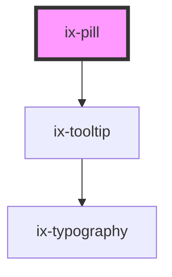

<!-- Auto Generated Below -->

## Properties

| Property        | Attribute         | Description                                                                                                                                                                        | Type                                                                                              | Default     |
| --------------- | ----------------- | ---------------------------------------------------------------------------------------------------------------------------------------------------------------------------------- | ------------------------------------------------------------------------------------------------- | ----------- |
| `alignLeft`     | `align-left`      | Align pill content left                                                                                                                                                            | `boolean`                                                                                         | `false`     |
| `ariaLabelIcon` | `aria-label-icon` | ARIA label for the icon                                                                                                                                                            | `string \| undefined`                                                                             | `undefined` |
| `background`    | `background`      | Custom color for pill. Only working for `variant='custom'`                                                                                                                         | `string \| undefined`                                                                             | `undefined` |
| `icon`          | `icon`            | Show icon                                                                                                                                                                          | `string \| undefined`                                                                             | `undefined` |
| `outline`       | `outline`         | Show pill as outline                                                                                                                                                               | `boolean`                                                                                         | `false`     |
| `pillColor`     | `pill-color`      | Custom font color for pill. Only working for `variant='custom'`                                                                                                                    | `string \| undefined`                                                                             | `undefined` |
| `tooltipText`   | `tooltip-text`    | Display a tooltip. By default, no tooltip will be displayed. Add the attribute to display the text content of the component as a tooltip or use a string to display a custom text. | `boolean \| string`                                                                               | `false`     |
| `variant`       | `variant`         | Pill variant                                                                                                                                                                       | `"alarm" \| "critical" \| "custom" \| "info" \| "neutral" \| "primary" \| "success" \| "warning"` | `'primary'` |

## Dependencies

### Depends on

- [ix-tooltip](../tooltip)

### Graph

----------------------------------------------

*Built with [StencilJS](https://stenciljs.com/)*
