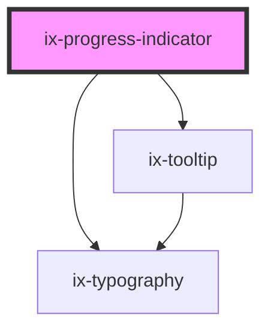

<!-- Auto Generated Below -->

## Properties

| Property            | Attribute              | Description                                                                                                | Type                                                                   | Default     |
| ------------------- | ---------------------- | ---------------------------------------------------------------------------------------------------------- | ---------------------------------------------------------------------- | ----------- |
| `helperText`        | `helper-text`          | The helper text for the progress indicator.                                                                | `string \| undefined`                                                  | `undefined` |
| `label`             | `label`                | The label for the progress indicator.                                                                      | `string \| undefined`                                                  | `undefined` |
| `max`               | `max`                  | The maximum value of the progress indicator.                                                               | `number`                                                               | `100`       |
| `min`               | `min`                  | The minimum value of the progress indicator.                                                               | `number`                                                               | `0`         |
| `showTextAsTooltip` | `show-text-as-tooltip` | Show the helper text as a tooltip                                                                          | `boolean`                                                              | `false`     |
| `size`              | `size`                 | The size of the progress indicator.                                                                        | `"lg" \| "md" \| "sm" \| "xl" \| "xs"`                                 | `'md'`      |
| `status`            | `status`               | The state of the progress indicator. This is used to indicate the current state of the progress indicator. | `"default" \| "error" \| "info" \| "paused" \| "success" \| "warning"` | `'default'` |
| `textAlignment`     | `text-alignment`       | The text alignment for the helper text. Can be 'left', 'center', or 'right'.                               | `"center" \| "left" \| "right"`                                        | `'left'`    |
| `type`              | `type`                 | The type of progress indicator to use.                                                                     | `"circular" \| "linear"`                                               | `'linear'`  |
| `value`             | `value`                | The value of the progress indicator.                                                                       | `number`                                                               | `0`         |

## Dependencies

### Depends on

- [ix-typography](../typography)
- [ix-tooltip](../tooltip)

### Graph

----------------------------------------------

*Built with [StencilJS](https://stenciljs.com/)*
