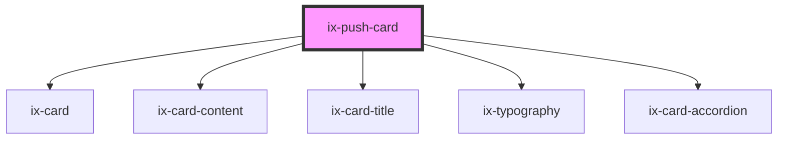

<!-- Auto Generated Below -->

## Properties

| Property        | Attribute         | Description             | Type                                                                                                           | Default     |
| --------------- | ----------------- | ----------------------- | -------------------------------------------------------------------------------------------------------------- | ----------- |
| `ariaLabelIcon` | `aria-label-icon` | ARIA label for the icon | `string \| undefined`                                                                                          | `undefined` |
| `expanded`      | `expanded`        | Expand the card         | `boolean`                                                                                                      | `false`     |
| `heading`       | `heading`         | Card heading            | `string \| undefined`                                                                                          | `undefined` |
| `icon`          | `icon`            | Card icon               | `string \| undefined`                                                                                          | `undefined` |
| `notification`  | `notification`    | Card KPI value          | `string \| undefined`                                                                                          | `undefined` |
| `subheading`    | `subheading`      | Card subheading         | `string \| undefined`                                                                                          | `undefined` |
| `variant`       | `variant`         | Card variant            | `"alarm" \| "critical" \| "filled" \| "info" \| "neutral" \| "outline" \| "primary" \| "success" \| "warning"` | `'outline'` |

## Dependencies

### Depends on

- [ix-card](../card)
- [ix-card-content](../card-content)
- [ix-card-title](../card-title)
- [ix-typography](../typography)
- [ix-card-accordion](../card-accordion)

### Graph

----------------------------------------------

*Built with [StencilJS](https://stenciljs.com/)*
